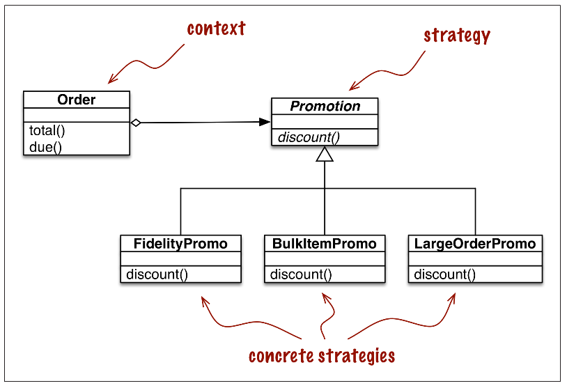
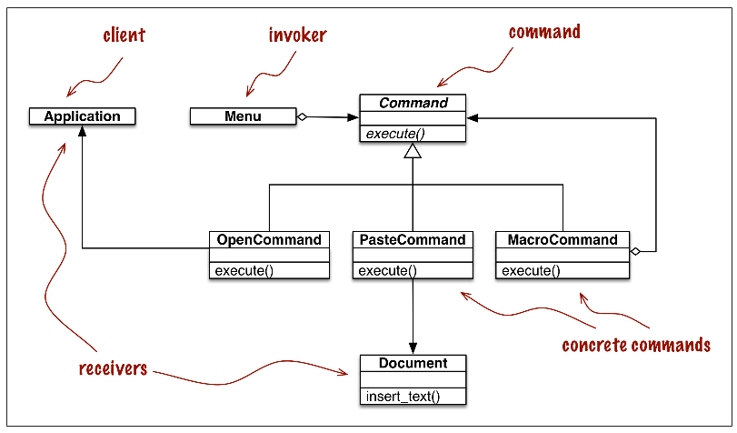

# FluentPython-P3-C6: Design Partterns with First Class Functions

In particular, in the context of languages with first-class functions, Norvig suggests
rethinking the Strategy, Command, Template Method and Visitor patterns. The general idea is: you can replace instances of some participant class in these patterns with simple functions, reducing a lot of boilerplate code.

## Table of Contents

*   [Refactoring Strategy](#refactoring-strategy)
    *   [Classic Strategy](#classic-strategy)
    *   [Function Oriented Strategy](#function-oriented-strategy)
    *   [Choosing The Best Strategy](#choosing-the-best-strategy)
*   [Command](#command)

## Refactoring Strategy

### Classic Strategy

Mô hình Strategy Pattern: Định nghĩa ra một họ các thuật toán tương tự nhau, đóng gói chúng vào những chức năng riêng biệt và khiến chúng có thể chuyển đổi qua lại với nhau. Strategy giúp thuật toán có khả năng thay đổi độc lập với cách thức người dùng sử dụng nó.



Dưới đây là code implement strategy pattern dưới lớp hướng đối tượng truyền thống:

```python
from abc import ABC, abstractmethod
from collections import namedtuple

Customer = namedtuple('Customer', 'name fidelity')


class LineItem:

    def __init__(self, product, quantity, price):
        self.product = product
        self.quantity = quantity
        self.price = price

    def total(self):
        return self.price * self.quantity


class Order:    # the context

    def __init__(self, customer, cart, promotion=None):
        self.customer = customer
        self.cart = list(cart)
        self.promotion = promotion

    def total(self):
        if not hasattr(self, '__total'):
            self.__total = sum(item.total() for item in self.cart)
        return self.__total

    def due(self):
        if self.promotion is None:
            discount = 0
        else:
            discount = self.promotion.discount(self)
        return self.total() - discount

    def __repr__(self):
        return '<Order total: {:.2f} due: {:.2f}>'.\
            format(self.total(), self.due())


class Promotion(ABC):   # the strategy - an Abstract Base Class

    @abstractmethod
    def discount(self, order):
        """Return discount as a positive dollar amount"""


class FidelityPromo(Promotion):  # first concrete strategy
    """5% discount with 1000 or more fidelity points"""

    def discount(self, order):
        return order.total() * 0.05\
            if order.customer.fidelity >= 1000 else 0


class BulkItemPromo(Promotion):  # second concrete strategy
    """10% discount for each LineItem with 20 or more units"""

    def discount(self, order):
        discount = 0
        for item in order.cart:
            if item.quantity >= 20:
                discount += item.total() * 0.1
        return discount


class LargeOrderPromo(Promotion):  # third concrete strategy
    """7% discount for orders with 10 or more distinct items """

    def discount(self, order):
        distinct_items = {item.product for item in order.cart}
        if len(distinct_items) >= 10:
            return order.total() * 0.07
        else:
            return 0
```

***Note:***

*   `abc.ABC`: base class cho các abstract classes
*   `abc.abstractmethod`: decorator cho abstract methods

### Function Oriented Strategy

Giữ nguyên các lớp ListItem và Order, thay các lớp tính promotion bằng các hàm tương ứng như sau:

```python
def fidelity_promo(order):
    """5% discount for customers with 1000 or more fidelity points"""
    return order.total() * .05 if order.customer.fidelity >= 1000 else 0


def bulk_item_promo(order):
    """10% discount for each LineItem with 20 or more units"""
    discount = 0
    for item in order.cart:
        if item.quantity >= 20:
            discount += item.total() * .1
    return discount


def large_order_promo(order):
    """7% discount for orders with 10 or more distinct items"""
    distinct_items = {item.product for item in order.cart}
    if len(distinct_items) >= 10:
        return order.total() * .07
    return 0
```

Bằng cách này, code của ta trông gọn gàng hơn và sử dụng nó cũng đơn giản hơn đôi chút. Điều này đạt được là bởi attribute `promotion` của lớp `Order` có thể là functions thay vì object, nhờ vào tính chất first-class của các function trong Python

### Choosing The Best Strategy

Do có ba chiến lược discount khác nhau nên khi thực hiện tính tiền cho các order, người dùng phải chọn chiến lược một cách thủ công, một hướng tiếp cận đơn giản nhằm tự động hóa thủ tục này đó là chọn chiến lược đem lại discount cao nhất đối với order:

```python
promos = [fidelity_promo, bulk_item_promo, large_order_promo]

def best_promo(order):
    """Select best discount available
    """
    return max(promo(order) for promo in promos)
```

Tuy nhiên, với cách tiếp cận này, nếu có strategy mới thì phải nhớ thêm nó vào `promos`

Để hạn chế "hard-code" thao tác này, ta có thể chỉnh sửa code như sau:

```python
promos = [globals()[name] for name in globals()
                    if name.endswith('_promo')
                    and name != 'best_promo']

def best_promo(order):
    """Select best discount available
    """
    return max(promo(order) for promo in promos)
```

***Note:***

*   `globals()`: built-in function giúp trả về `__dict__` của module hiện thời

## Command

Command cũng là một design pattern có thể được đơn giản hóa bằng cách sử dụng first class function trong Python

*Here a UML class diagram for menu-driven text editor implemented with the
Command design pattern. Each command may have a different receiver: the object that implements the action. For PasteCommand, the receiver is the Document. For OpenCommand the receiver is the application:*



Mục đích của Command là để tách biệt đối tượng gọi đến một hành động (Invoker) và đối tượng implement hành động đó (Receiver). Để làm được điều này, một đối tượng Command được đặt giữa Invoker và Receiver. Invoker muốn kích hoạt một hành động, nó sẽ gọi đến phương thức `execute` của một lớp concrete Command tương ứng, lớp con này kết hợp một vài phương thức mà Receiver cung cấp để thực hiện hành động. Như vậy, phía Invoker không cần biết về interface của Receiver mà quá trình yêu cầu lệnh thông qua lớp trung gian Command.

Vậy đơn giản hóa ý tưởng trên sử dụng first-class functions như thế nào? Ta chỉ cần implement `Command` thành một hàm `command` và thay vì gọi `Command().execute()` thì chỉ cần gọi `command()` để thực hiện hành động

Đối với một Command mà thực hiện một chuỗi các command, như `MacroCommand` trong ví dụ trên thì sao? Câu trả lời là implement phương thức `__call__` cho lớp này:

```python
class MacroCommand:
    """A command that executes a list of commands"""
    def __init__(self, commands):
        self.commands = list(commands)
    def __call__(self):
        for command in self.commands:
        command()
```

