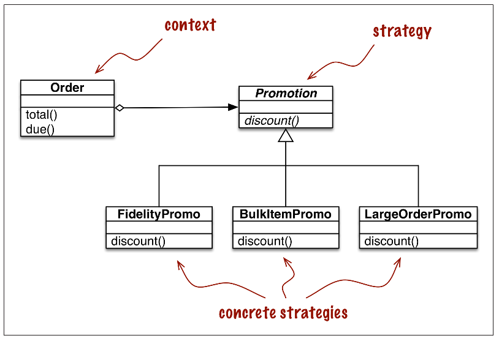

## Chapter 6: Design Partterns with First Class Functions

Design patterns là các giải pháp điển hình dùng để giải quyết các vấn đề thường gặp trong thiết kế phần mềm. Mặc dù về bản chất, design patterns không phụ thuộc vào ngôn ngữ lập trình, song không phải tất cả các ngôn ngữ lập trình đều có thể implement mọi design patterns. Thực tế cho thấy, phần lớn các design patterns đều đơn giản hơn hoặc thậm chí là được hỗ trợ sẵn trong các ngôn ngữ lập trình động.

Trong các ngôn ngữ mà functions là các first-class citizens như Python, việc triển khai các design patterns như Strategy, Command, Template Method hay Visitor sử dụng hàm là đơn giản hơn rất nhiều. Trong chương này, chúng ta sẽ tìm cách implement Strategy và Command design pattern sử dụng hàm trong Python, qua đó cho thấy điểm khác biệt đối với các cơ chế truyền thống.

---
### Table of Contents

- [Chapter 6: Design Partterns with First Class Functions](#chapter-6-design-partterns-with-first-class-functions)
  - [Table of Contents](#table-of-contents)
  - [Refactoring Strategy](#refactoring-strategy)
    - [Classic Strategy](#classic-strategy)
    - [Function Oriented Strategy](#function-oriented-strategy)
    - [Choosing The Best Strategy](#choosing-the-best-strategy)
    - [Finding Strategies in a Module](#finding-strategies-in-a-module)
  - [Command](#command)

---
### Refactoring Strategy

Mục này giới thiệu qua về Strategy design patterns và lấy ví dụ qua cách tính giảm giá đơn hàng. Sau đó, ta sẽ triển khai design pattern này theo cách truyền thống và cách sử dụng first-class functions. Qua đó thấy được sự đơn giản và tiện dụng của first-class functions khi implement strategy pattern trong Python.

---
#### Classic Strategy

Strategy Pattern: Định nghĩa ra một họ các thuật toán tương tự nhau và đóng gói chúng vào những chức năng riêng biệt mà có thể thay thế lẫn nhau. Strategy giúp thuật toán có khả năng thay đổi độc lập với cách thức người dùng sử dụng nó.

Ví dụ, ta có một đơn hàng với nhiều sản phẩm khác nhau cũng như nhiều chiến lược tinh giảm giá khác nhau. Để sử dụng các chiến lược khác nhau cho các đơn hàng, ta cần định nghĩa một phương thức tính giảm giá chung (`discount()`) và mỗi chiến lược sẽ triển khai phương thức đó theo một cách khác nhau. Như vậy, trên đơn hàng ta có thể áp dụng chiến lược giảm giá bất kỳ bằng cách gọi hàm `discount()` mà không cần quan tâm tới cách thức thực thi cụ thể.




Trước tiên, ta sẽ định nghĩa một module chứa các lớp:
-   `LineItem`: Chứa thông tin loại sản phẩm, giá tiền và số sản phẩm trong đơn hàng
-   `Order`: Chứa thông tin khách hàng, giỏ hàng và thông tin giảm giá
-   `Promotion`: Là một abstract interface chứa một abstract method là `discount`, các chiến lược giảm giá khác nhau sẽ implement interface này và định nghĩa các cách thức giảm giá khác nhau

```python
from abc import ABC, abstractmethod
from collections import namedtuple

Customer = namedtuple('Customer', 'name fidelity')


class LineItem:
    def __init__(self, product, quantity, price):
        self.product = product
        self.quantity = quantity
        self.price = price

    def total(self):
        return self.price * self.quantity


class Order:
    def __init__(self, customer, cart, promotion=None):
        self.customer = customer
        self.cart = list(cart)
        self.promotion = promotion

    def total(self):
        if not hasattr(self, '__total'):
            self.__total = sum(item.total() for item in self.cart)
        return self.__total

    def due(self):
        if self.promotion is None:
            discount = 0
        else:
            discount = self.promotion.discount(self)
        return self.total() - discount

    def __repr__(self):
        return '<Order total: {:.2f} due: {:.2f}>'.\
            format(self.total(), self.due())


class Promotion(ABC):
    @abstractmethod
    def discount(self, order):
        """Return discount as a positive dollar amount"""
```

Giả sử ta có ba chiến lược giảm giá khác nhau:
-   `FidelityPromo`: Giảm giá cho khách hàng thân thiết (tính theo điểm tích lũy)
-   `BulkItemPromo`: Chiết khấu khi mua nhiều sản phẩm cùng loại
-   `LargeOrderPromo`: Giảm giá cho đơn hàng có nhiều loại sản phẩm

Theo Strategy design pattern, ta sẽ phải định nghĩa ba phương thức khác nhau implement `Promotion` interface bằng cách viết ba lớp cụ thể thừa kế từ lớp trừu tượng `Promotion` như sau:

```python
class FidelityPromo(Promotion):  # first concrete strategy
    """5% discount with 1000 or more fidelity points"""
    def discount(self, order):
        return order.total() * 0.05\
            if order.customer.fidelity >= 1000 else 0


class BulkItemPromo(Promotion):  # second concrete strategy
    """10% discount for each LineItem with 20 or more units"""
    def discount(self, order):
        discount = 0
        for item in order.cart:
            if item.quantity >= 20:
                discount += item.total() * 0.1
        return discount


class LargeOrderPromo(Promotion):  # third concrete strategy
    """7% discount for orders with 10 or more distinct items """
    def discount(self, order):
        distinct_items = {item.product for item in order.cart}
        if len(distinct_items) >= 10:
            return order.total() * 0.07
        else:
            return 0
```

Sử dụng module này để tinh giá tiền cho đơn hàng:
```python
>>> joe = Customer('John Doe', 0)
>>> cart = [LineItem('banana', 4, .5),
...         LineItem('apple', 10, 1.5),
...         LineItem('watermellon', 5, 5.0)]
>>> Order(joe, cart, FidelityPromo())
<Order total: 42.00 due: 42.00>
```
---
#### Function Oriented Strategy

Vấn đề dễ nhận thấy nhất đối với cách implement Strategy Pattern truyền thống là ta phải định nghĩa ra một lớp trừu tượng và nhiều lớp cụ thể chỉ để implement một phương thức `promotion` - thứ hoàn toàn có thể được thay thế bởi một function như sau:

1.  Định nghĩa lại lớp `Order` nhận `promotion` là một hàm thay vì một đối tượng và gọi hàm `promotion` này khi tính giảm giá
    ```diff
    - discount = self.promotion.discount(self)
    + discount = self.promotion(self)
    ```
2.  Loại bỏ lớp trừu tượng và các lớp tính giảm giá, thay bằng các hàm tính giảm giá như sau:
    ```python
    def fidelity_promo(order):
        """5% discount for customers with 1000 or more fidelity points"""
        return order.total() * .05 if order.customer.fidelity >= 1000 else 0


    def bulk_item_promo(order):
        """10% discount for each LineItem with 20 or more units"""
        discount = 0
        for item in order.cart:
            if item.quantity >= 20:
                discount += item.total() * .1
        return discount


    def large_order_promo(order):
        """7% discount for orders with 10 or more distinct items"""
        distinct_items = {item.product for item in order.cart}
        if len(distinct_items) >= 10:
            return order.total() * .07
        return 0
    ```

Bằng cách này, code của ta trông gọn gàng hơn và sử dụng nó cũng đơn giản hơn đôi chút. Điều này đạt được là bởi attribute `promotion` của lớp `Order` có thể là functions thay vì object, nhờ vào tính chất first-class của các function trong Python.

Sử dụng module mới để tính giá:
```python
>>> joe = Customer('John Doe', 0)
>>> cart = [LineItem('banana', 4, .5),
...         LineItem('apple', 10, 1.5),
...         LineItem('watermellon', 5, 5.0)]
>>> Order(joe, cart, fidelity_promo)
<Order total: 42.00 due: 42.00>
```

---
#### Choosing The Best Strategy

Do có ba chiến lược giảm giá khác nhau nên khi thực hiện tính tiền cho các đơn hàng, người dùng phải chọn chiến lược một cách thủ công, một hướng tiếp cận đơn giản nhằm tự động hóa thủ tục này đó là chọn chiến lược giúp giảm giá nhiều nhất cho đơn hàng:

```python
promos = [fidelity_promo, bulk_item_promo, large_order_promo]

def best_promo(order):
    """Select best discount available
    """
    return max(promo(order) for promo in promos)
```

Ta có thể dùng `best_promo` như là một chiến lược giảm giá khi tính tiền cho đơn hàng.

---
#### Finding Strategies in a Module

Vấn đề tiếp theo: Nếu có strategy mới thì ta phải nhớ nó vào danh sách `promos`. Để hạn chế "hard-code" thao tác này, ta có thể chỉnh sửa code như sau:

```python
promos = [globals()[name] for name in globals()
                    if name.endswith('_promo')
                    and name != 'best_promo']

def best_promo(order):
    """Select best discount available
    """
    return max(promo(order) for promo in promos)
```

***Note:***

-   `globals()`: built-in function giúp trả về `__dict__` của module hiện thời

---
### Command

Command cũng là một design pattern có thể được đơn giản hóa bằng cách sử dụng first class function trong Python

*Here a UML class diagram for menu-driven text editor implemented with the
Command design pattern. Each command may have a different receiver: the object that implements the action. For PasteCommand, the receiver is the Document. For OpenCommand the receiver is the application:*


Mục đích của Command là để tách biệt đối tượng gọi đến một hành động (Invoker) và đối tượng implement hành động đó (Receiver). Để làm được điều này, một đối tượng Command được đặt giữa Invoker và Receiver. Invoker muốn kích hoạt một hành động, nó sẽ gọi đến phương thức `execute` của một lớp concrete Command tương ứng, lớp con này kết hợp một vài phương thức mà Receiver cung cấp để thực hiện hành động. Như vậy, phía Invoker không cần biết về interface của Receiver mà quá trình yêu cầu lệnh thông qua lớp trung gian Command.

Vậy đơn giản hóa ý tưởng trên sử dụng first-class functions như thế nào? Ta chỉ cần thay thế các lớp implement `Command` bằng các hàm `command` và thay vì gọi `Command().execute()` thì chỉ cần gọi `command()` để thực hiện hành động

Đối với một Command mà thực hiện một chuỗi các command khác, như `MacroCommand` trong ví dụ trên thì sao? Câu trả lời là implement phương thức `__call__` cho lớp `MacroCommand`, đối tượng của lớp này sẽ là một callable object có chức năng tương tự như command function ở trên:
 
```python
class MacroCommand:
    """A command that executes a list of commands"""
    def __init__(self, commands):
        self.commands = list(commands)
    def __call__(self):
        for command in self.commands:
        command()
```

