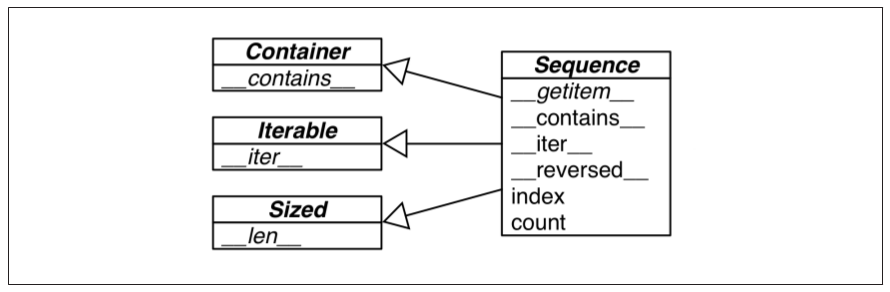

# Interfaces: From Protocols to ABCs

-   Protocols: Dynamic duck-typing
-   ABCs (Abstract Base Classes): make explicit interfaces and verify implementations for conformance

## Interfaces and Protocols in Python Culture

## Python Digs Sequences

Dưới đây là các sequence interface chuẩn với các phương thức được yêu cầu implements và các lớp trừu tượng mà nó kết thừa, tất cả cùng nằm trong `collections.abc`:



Dưới đây là ví dụ về một class chỉ implement phương thức `__getitem__` cho sequence protocol, không sử dụng ABC:

```python
class Foo:
    def __getitem__(self, pos):
        return range(0, 30, 10)[pos]
```

Chỉ vậy là đủ để ta sử dụng các thao tác và cú pháp: truy cập phần tử (bởi cặp ngoặc vuông), duyệt qua sequence và toán tử `in`:

```python
>>> f = Foo()
>>> for i in f: print(i)
...
0
10
20
>>> 20 in f
True
>>> 15 in f
False
```
Chưa có phương thức `__iter__` được implement bất thể hiện của `Foo` vẫn là iterable bởi vì thao tác duyệt được fall-back tới phương thức `__getitem__`.

## Waterfowl and ABCs

Protocols và duck-typing là công cụ hữu hiệu để lập trình tổng quát. Một phương thức duck-typing không cần quan tâm tham số truyền vào nó thuộc kiểu nào mà vẫn hoạt động tốt. Một phương thức dùng quá nhiều chuỗi `if/elif/elif...` để xử lý các kiểu dữ liệu khác nhau không được cho là biểu hiện của một sự thiết kế hướng đối tượng tốt. Những built-in functions như `isinstance` và `issubclass` bởi vậy không được khuyên dùng vì nó trái với triết lý lập trình đa hình.

Trong tự nhiên, nhiều khi xảy ra trường hợp hai loài có cùng đặc điểm di truyền do tình cờ chứ không phải do cùng chung nguồn gốc. Việc xác định tính gần gũi về mặt di truyền của hai loài vì thế phải dựa trên giám định gen chứ không phải dựa trên quan sát kiểu hình. Nói cách khác, đôi khi một con vật đi như con vịt, kêu như con vịt chưa hẳn đã là con vịt :v. Tương tự như vậy, việc lập trình duck-typing đôi khi cần phải đi kèm với những ràng buộc chặt chẽ hơn, nói vui là *goose-typing*. Vì lí do đó, `interface` và `ABC` classes ra đời.

Một class có thể xác định lớp trừu tượng cha (abstract base class - ABC) cho mình bằng việc thừa kế từ chính lớp đó hoặc `register` lớp đó. Sau đó, việc sử dụng phương thức `isinstance` để kiểm tra đối tượng hiện tại có implements/inherits một ABC nào đó được yêu cầu không là một cách để thông báo rằng "Implement những thứ này đi rồi hãy gọi cho tôi!". Điều này hay xảy ra khi xây dựng hoặc làm việc với các frameworks. Bên ngoài phạm vi framework, duck-typing luôn là lựa chọn đơn giản và mềm dẻo hơn.

Một ví dụ: Cần implement một class mà phương thức khởi tạo yêu cầu đầu vào là một `list`. Trong phần lớn trường hợp, việc dùng luôn `list()` constructor để biến tham số thành list trước khi khởi tạo đối tượng là một cách làm đơn giản và hợp lí. Trong các trường hợp đặc biệt khi ta không nên copy tham số vì nó quá lớn hoặc cần được thay đổi trực tiếp, việc kiểm tra `isinstance(x, abc.MutableSequence)` là cách làm tốt hơn.

Bây giờ, hãy cùng sử dụng *goose-typing* trong các ví dụ thực tế.

## Subclassing an ABC

Dưới đây là ví dụ thiết kế một `FrenchDeck` sử dụng interface `collections.MutableSequence`:

```python
import collections

class FrenchDeck(collections.MutableSequence):
	ranks = tuple(str(i) for i in range(2, 11)) + tuple('JQKA')
	suits = 'spades diamonds clubs hearts'.split()

	def __init__(self):
		self._cards = [Card(rank, suit) for suit in self.suits
										for rank in self.ranks]

	def __len__(self):
		return len(self._cards)

	def __getitem__(self, position):
		return self._cards[position]

	def __setitem__(self, position, value):
		self._cards[position] = value

	def __delitem__(self, position):
		del(self._cards[position])

	def insert(self, position, value):
		self._cards.insert(position, value)

```

Các phương thức được implement ở trên là tối thiểu đối với một `collections.MutableSequence`, thiếu bất kỳ phương thức nào cũng sẽ tạo ra một exception `TypeError` **tại runtime** (thời điểm một đối tượng FrenchDeck được khởi tạo). Dưới đây là mối quan hệ giữa `Mutable Sequence` và các abstract Class khác mà nó thừa kế (các phương thức in nghiêng là abstract methods):


Các phương thức không được in nghiêng là các phương thức ready-to-use ngay khi các phương thức abstract được implement, người dùng có thể sử dụng chúng mà không cần phải implement lại.

## ABCs in The Standard Library

Kể từ Python 2.6, ABCs trở nên có sẵn trong thư viện chuẩn. Hầu hết ABCs được định nghĩa trong module `collections.abc`, số khác trong các packages như `number`, `io`, etc.

### ABCs in **`collections.abc`**

Dưới đây là biểu đồ UML các ABCs trong module `collections.abc`:


-   `Iterable`, `Container`, và `Sized`: Tất cả các collection implement dựa vào interface (không dùng protocol) nên implement cả ba lớp này. `Iterable` hỗ trợ thao tác duyệt với `__iter__`, `Container` hỗ trợ toán tử `in` với phương thức `__contains__` và `Sized` hỗ trợ `len()` với phương thức `__len__`
-   `Sequence`, `Mapping` và `Set`: Đây là các kiểu immutable collections đặc trưng, mỗi loại đều có một subclass mutable tương ứng: `MutableSequence`, `MutableMapping` và `MutableSet`
-   `MappingView`: Hỗ trợ các phương thức mapping. `ItemsView` hỗ trợ `.items()`, `ValuesView` hỗ trợ `.values()`, `KeysView` hỗ trợ `.keys()`
-   `Callable`và `Hashable`: Chức năng chính là để hỗ trợ `isinstance` kiểm tra xem một object có là callable hay hashable không
-   `Iterator`: Thừa kế `Iterable`, sẽ được bàn đến ở chương 14

### ABCs in **`numbers`**

Các ABCs trong package `number` có quan hệ bao chứa, các lớp sau có mức độ trừu tượng thấp hơn và chứa trong lớp dưới:

    ```python
    Number > Complex > Real > Rational > Integral
    ```
Cú pháp `isinstance(x, numbers.Real)` chấp nhận x là bất kỳ kiểu nào trong số: `bool`, `int`, `float`, `fractions.Fraction` hay bất kỳ kiểu số thực nào được định nghĩa trong các thư viện ngoài như `Numpy`, `Scipy` hay `Tensorflow`.

## Defining and Using an ABC

Usecase phổ biến nhất để sử dụng ABC interfaces là tạo và làm việc với frameworks.

Kịch bản: Tạo một framework nhằm hỗ trợ các class có chức năng lựa chọn ngẫu nhiên không lặp lại phần tử thuộc một container. Các class này được cung cấp bởi người sử dụng framework, ta cần tạo interface để đảm bảo tính hợp lệ cho chúng.

Dưới đây là một mô hình interface:


Chú ý, các phương thức in nghiêng là abstract methods.

Trong đó `Tombola` là ABC định nghĩa ra một class có chức năng như trong yêu cầu một cách hợp lệ. các phương thức của nó là:

-   *`.load(...)`*: thêm item vào container
-   *`.pick()`*: loại bỏ một phần tử ngẫu nhiên nằm trong container và trả về nó
-   `.loaded()`: trả về True nếu như có ít nhất một item nằm trong container
-   `.inspect()`: trả về một `tuple` được sắp xếp được tạo từ các items nằm trong container mà không làm thay đổi nội dung của nó

Các class phía dưới hoặc thừa kế, hoặc sử dụng (register) ABC này.

Dưới đây là code class `Tombola`:

```python
import abc

class Tombola(abc.ABC):

	@abc.abstractmethod
	def load(self, iterable):
		"""Add items from an iterable"""

	@abc.abstractmethod
	def pick(self):
		"""Remove item at random, returning it.

		This method should raise `LookupError` when the instance is empty
		"""
	def loaded(self):
		"""Return `True` if there's at least 1 item, `False` otherwise"""
		return bool(self.inspect())

	def inspect(self):
		"""Return a sorted tuple with the items currently inside."""
		items = []
		while True:
			try:
				items.append(self.pick())
			except LookupError:
				break
		self.load(items)
		return tuple(sorted(items))
```

*Chú ý:*

-   Sử dụng decorator `abc.abstractmethod` để định nghĩa abstract methods
-   Abstract methods thường để trống, chỉ có docstring cho phương thức
-   Phương thức `inspect` cho thấy ta có thể implement phương thức cụ thể nằm trong một ABC class, miễn là nó chỉ sử dụng các phương thức khác nằm trong class đó

Hãy xem cách mà `Tombola` kiểm tra các class implement nó:

```python
>>> from tombola import Tombola
>>> class Fake(Tombola): #
...
def pick(self):
...
return 13
...
>>> Fake
<class '__main__.Fake'>
>>> f = Fake()
Traceback (most recent call last):
File "<stdin>", line 1, in <module>
TypeError: Can't instantiate abstract class Fake with abstract methods load
```

### ABC Syntax Details

Cú pháp sử dụng (thừa kế) một `abc.ABC` class trong các phiên bản Python khác nhau:

-   Python 2: 
    ```python
    class Tombola(object):
    __metaclass__ = abc.ABCMeta
    # ...
    ```
-   Python 3, version &lt; 3.4:
    ```python
    class Tombola(metaclass=abc.ABCMeta):
        #...
    ```
-   Python 3.4+:
    ```python
    class Tombola(abc.ABC)
    ```

Bên cạnh `@abstractmethod`, `abc` còn định nghĩa `@abstractclassmethod`, `@abstractstaticmethod` và `@abstractproperty`. Tuy nhiên, kể từ Python 3.3, 3 decorator sau không còn được hỗ trợ vì sự xuất hiện của cơ chế chồng decorator. Ví dụ ta có thể tạo một abstract class method như sau:

    ```python
    class MyABC(abc.ABC):
        @classmethod
        @abc.abstractmethod
        def an_abstract_classmethod(cls, ...):
            pass
    ```
Chú ý rằng, `@abc.abstractmethod` là decorator nằm trong cùng trên chồng decorators.

### Subclassing The Tombola ABC

Dưới đây là hai class sử dụng `Tombola` interface mà ta sẽ định nghĩa:
-   `BingoCage`: Sử dụng luôn hai phương thức `inspect` và `loaded` của `Tombola`
-   `LotteryBlower`: Overwrite hai phương thức trên để việc tính toán hiệu quả hơn

```python
import random

class BingoCage(Tombola):

	def __init__(self, items):
		self._randomizer = random.SystemRandom()
		self._items = []
		self.load(items)

	def load(self, items):
		self._items.extend(items)
		self._randomizer.shuffle(self._items)

	def pick(self):
		try:
			return self._items.pop()
		except IndexError:
			raise LookupError('pick from empty BingoCage')

	def __call__(self):
		self.pick()
```

*Chú ý:*

-   Phương thức `load` nạp thêm các phần tử từ một iterable vào list `_items` hiện tại bằng phương thức `extend`
-   Phương thức `pick` raise lại `LookupError` exception giống như trong docstring yêu cầu

```python
class LotteryBlower(Tombola):
	
	def __init__(self, iterable):
		self._balls = list(iterable)

	def load(self, iterable):
		self._balls.extend(iterable)

	def pick(self):
		try:
			position = random.randrange(len(self._balls))
		except ValueError:
			raise LookupError('pick from empty LotteryBlower')
		return self._balls.pop(position)

    def loaded(self):
        return bool(self._balls)

	def inspect(self):
		return tuple(sorted(self._balls))

```

Cách làm này bắt mắt và hiệu quả hơn rất nhiều.

### A Virtual Subclass of Tombola

Ta có thể đăng kí một virtual subclass cho một `ABC` bằng phương thức `register` của `ABC` đó. Các virtual subclass sau đó có thể được nhận dạng bằng các phương thức `issubclass` hay `isinstance` tuy nhiên không thừa kế bất kì thuộc tính hay phương thức nào của ABC gốc cũng như về bản chất không là một lớp con của `ABC` đó. Bên cạnh đó, việc implement các phương thức abstract yêu cầu bởi `ABC` không được kiểm tra tại loadtime mà tại runtime.

Dưới đây là ví dụ về class `TomboList` inherits `list` và register `Tombola`:


Implement class này:

```python
@Tombola.register
class TomboList(list):
	
	def load = list.extend

	def pick(self):
		if self:
			position = randrange(len(self))
			return self.pop(position)
		else:
			raise LookupError('pop from empty TomboList')

	def loaded(self):
		return bool(self)


	def inspect(self):
		return tuple(sorted(self))
```

*Chú ý:*

-   `TomboList` được registered cho `Tombola` sử dụng decorator `@Tombola.register` (version > 3.3)
-   Trường hợp phiên bản Python là từ 3.3 trở xuống, cú pháp hợp lệ cho quá trình register là:
    ```python
    Tombola.register(TomboList)
    ```
## Geese Can Behave Like Ducks

Chỉ cần implement `__len__` cho class `Foo`, nó sẽ khiến cho biểu thức `isinstance(Foo(), abc.Sized)` và `issubclass(Foo, abc.Sized)` nhận giá trị `True`, tương tự với các abstract classes khác trong danh sách các abc abstract classes đã đề cập đến ở phần đầu bài viết

## Interfaces in Java, Go and Rugby

Đoạn văn dưới đây bàn về khái niệm interface trong các ngôn ngữ lập trình khác nhau của tác giả. Nội dung này nằm trong phần Soapbox cuối chương 11, xin để nguyên văn:

"Since C++ 2.0 (1989), abstract classes have been used to specify interfaces that language.

The designers of Java opted not to have multiple inheritance of classes, which precluded the use of abstract classes as interface specifications — because often a class needs to implement more than one interface. But they added the interface as a language construct, and a class can implement more than one interface — a form of multiple inheritance. Making interface definitions more explicit than ever was a great contribution of Java. With Java 8, an interface can provide method implementations, called Default Methods. With this, Java interfaces became closer to abstract classes in C++ and Python.

The Go language has a completely different approach. First of all, there is no inheritance in Go. You can define interfaces, but you don’t need (and you actually can’t) explicitly say that a certain type implements an interface. The compiler determines that automatically. So what they have in Go could be called “static duck typing”, in the sense that interfaces are checked at compile time but what matters is what types actually implement. Compared to Python, it’s as if, in Go, every ABC implemented the `__subclasshook__` checking function names and signatures, and you never subclassed or registered an ABC. If we wanted Python to look more like Go, we would have to perform type checks on all function arguments. Some of the infrastructure is available (recall “Function annotations” on page 154). Guido has already said he thinks it’s OK to use those annotations for type checking — at least in support tools. See “Soapbox” on page 163 in Chapter 5 for more about this.

Rubyists are firm believers in duck typing, and Ruby has no formal way to declare an interface or an abstract class, except to do the same we did in Python prior to 2.6: `raise NotImplementedError` in the body of methods to make them abstract by forcing the user to subclass and implement them. Meanwhile, I read that Yukihiro “Matz” Matsumoto, creator of Ruby, said in a keynote in September, 2014, that static typing may be in the future of the language. That was at Ruby Kaigi in Japan, one of the most important Ruby conferences every year. As I write this I haven’t seen a transcript, but Godfrey Chan posted about it in his blog: Ruby Kaigi 2014: Day 2. From Chan’s report, it seems Matz focused on function annotations. There is even mention of Python function annotations. I wonder if function annotations would be really good without ABCs to add structure to the type system without losing flexibility. So maybe formal interfaces are also in the future of Ruby.

I believe Python ABCs, with the register function and `__subclasshook__` , brought formal interfaces to the language without throwing away the advantages of dynamic
typing.

Perhaps the geese are poised to overtake the ducks."
