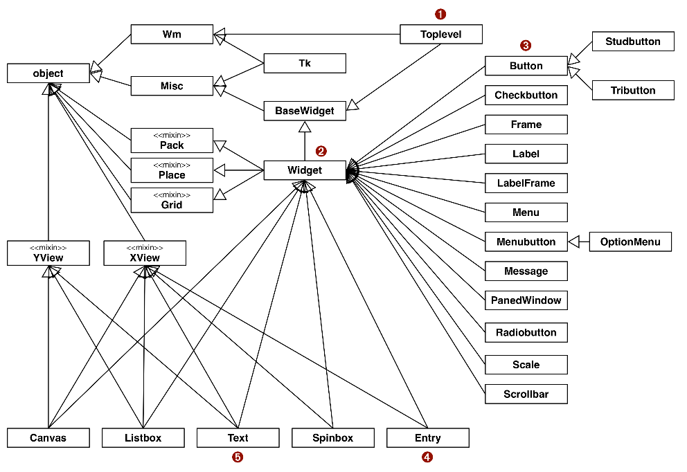
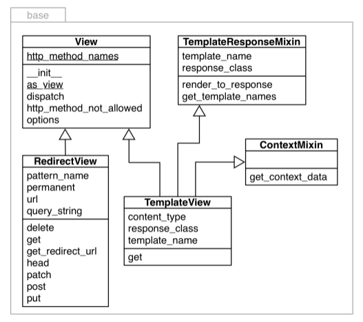
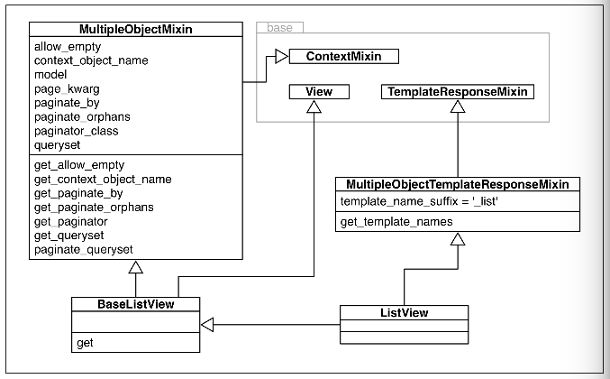

# Inheritance: For Good or For Worse

## Subclassing Built in Types is Tricky

Khi thừa kế một kiểu built-in, nếu như ta ghi đè một phương thức nào đó thì phương thức đó sẽ chỉ có thể được sử dụng khi gọi trực tiếp, trong các trường hợp khác, phương thức được xây dựng ban đầu của kiểu built-in sẽ được sử dụng thay thế.

=> Không nên thừa kế một kiểu built-in

## Multiple Inheritance and Method Resolution Order

Đa thừa kế dẫn tới nguy cơ tiềm ẩn xung đột tên giữa các class tổ tiên, vấn đề này thường được gọi với tên "diamond problem". Ví dụ:

```python
class A:
	def ping(self):
	print('ping:', self)


class B(A):
	def pong(self):
	print('pong:', self)


class C(A):
	def pong(self):
	print('PONG:', self)


class D(B, C):
	def ping(self):
		super().ping()
		print('post-ping:', self)

	def pingpong(self):
		self.ping()
		super().ping()
		self.pong()
		super().pong()
		C.pong(self)
```

Quan hệ thừa kế của các lớp này được cho bởi biểu đồ UML sau:


Biểu đồ bên trái là phả hệ hình kim cương của các lớp, bên phải là thứ tự phân giải phương thức của các lớp này.

*Chú ý:*

*   Nếu ta gọi phương thức `pong` tại một thể hiện của lớp D, phương thức `pong` của lớp B sẽ được gọi tới vì nó được khai báo trước trong chữ ký lớp của D:

    ```python
    >>> D().pong()
    pong: <__main__.D object at 0x7f279663bdd8>
    ```
*   Nếu muốn chủ động gọi phương thức `pong` từ lớp C với thể hiện của lớp D, hãy dùng cú pháp:

    ```python
    >>> C.pong(D())
    PONG: <__main__.D object at 0x7f279663be10>
    ```
*   Khi gọi đến một phương thức không được implement ở lớp hiện tại, Python bắt đầu tìm kiếm phương thức đó tại các lớp trên cây phả hệ của lớp này theo một thứ tự nhất định. Thứ tự này nằm trong trường thuộc tính `__mro__`:

    ```python
    >>> D.__mro__
    (<class '__main__.D'>, <class '__main__.B'>, <class '__main__.C'>, <class '__main__.A'>, <class 'object'>)
    ```

*   Khi cần gọi đến một phương thức nào đó ở một trong các lớp tổ tiên, cách được đề xuất là sử dụng `super()`, hạn chế việc 'hard-code' `C.ping(self)`

*   `super()` và `self` cùng duyệt qua các lớp trong danh sách `__mro__` để quyết định việc thực hiện lời gọi phương thức ở lớp nào. Điểm khác biệt là `super()` bỏ qua lớp hiện tại trong khi `self` có kiểm tra việc lớp hiện tại có implement phương thức này hay không

Thuật toán phân giải thứ tự các lớp trên đồ thị thừa kế có tên là C3, có thể được tìm đọc tại [đây](https://www.python.org/download/releases/2.3/mro/)

## Multiple Inheritance in The Real World

Trong thư viện chuẩn của Python `Tkinter` là package phục vụ lập trình giao diện người dùng. Nó định nghĩa nhiều lớp khác nhau, các lớp có mối quan hệ kế thừa tạo thành đồ thị thừa kế sau:



## Coping with Multiple Inheritance

Đa thừa kế về bản chất rất phức tạp để duy trì và xử lý. Để tránh việc tạo ra một đồ thị thừa kế rối rắm và không nhất quán, cần chú ý các điều sau:

1.  Phân biệt rõ ràng giữa thừa kế để implement interface và thừa kế thuần (chỉ nhằm mục đích tái sử dụng code). Java giúp làm điều này tốt hơn khi tách biệt khái niệm interfaces và abstract classes, còn Python thì không. Nếu thừa kế vì mục đích thứ nhất, hãy đảm bảo rằng interface - xương sống của framework được thiết kế một cách gọn gàng và trong sáng. Nếu thừa kế vì mục đích thứ hai, hãy chắc chắn rằng việc làm này là cần thiết.

1.  Implement interface một cách công khai và rõ ràng thông qua ABCs

1.  Code reuse sử dụng mixin classes. Một mixin là một class implement các phương thức có thể dùng cho các class khác không có quan hệ gì với nó. Mixins không chứa các thuộc tính (trừ hằng số) và vì thế không nên khởi tạo đối tượng từ mixin. So sánh với Java, mixins giống như interface có sử dụng default methods.

1.  Đặt tên rõ ràng cho mixin với hậu tố `...Mixin`

1.  Không thừa kế nhiều hơn một concrete class: Một lớp bất kỳ chỉ nên có tối đa một lớp cha không phải là ABC hoặc mixin

1.  Tạo ra các lớp tổng hợp: Một lớp tổng hợp là lớp thừa kế các ABCs hoặc mixins liên quan với nhau cùng phối hợp thực hiện một tác vụ nào đó. Người dùng sử dụng các lớp này không cần phải nhớ hết các ABCs hoặc mixins cần thiết. Đây là ví dụ về lớp `Widget` của `Tkinter`:

    ```python
    class Widget(BaseWidget, Pack, Place, Grid):
        """Internal class.
        Base class for a widget which can be positioned with the
        geometry managers Pack, Place or Grid."""
        pass
    ```

    => `Widget` chỉ có nhiệm vụ gom nhóm, không chứa nội dung nào khác

1.  Nếu có thể, hãy sử dụng cấu thành thay vì thừa kế: Nếu muốn tạo ra một sequence, không thừa kế list, hãy tham chiếu đến một thể hiện của list. Cấu thành, đi đôi với ủy nhiệm giúp giải quyết vấn đề một cách mềm dẻo, đơn giản và tiết kiệm chi phí hơn thừa kế trong nhiều trường hợp

## Mixins in Django Generic Views

Trong Django, một khung nhìn (view) là một callable object mà nhận vào tham số là một HTTP request object và trả về một HTTP response object. Responses rất đa dạng, có thể là một sự chuyển hướng (redirect response) với nội dung là rỗng hoặc cũng có thể phức tạp như một trang catalog của một cửa hàng trực tuyến, được rendered từ một HTML template chứa nhiều thành phần khác nhau.

Ban đầu, Django cung cấp một tập hợp các hàm, gọi là generic views, triển khai một vài các ca sử dụng phổ biến. Ví dụ, nhiều trang web cần hiển thị ra kết quả tìm kiếm chứa thông tin của nhiều item nằm trên nhiều trang khác nhau, mỗi item lại có một link đến trang chứa thông tin chi tiết của nó. Trong Django, list view và detail view được thiết kế để giải quyết vấn đề này: list view render các kết quả trong khi detail view tạo ra các trang cho từng kết quả.

Tuy nhiên, các generic views này là cac hàm, và vì vậy không thể mở rộng được. Nếu như bạn muốn làm thứ gì đó tương tự nhưng khác một chút với chúng, bạn sẽ phải triển khai lại từ đầu.

Kể từ Django 1.3, khái niệm class-based view xuất hiện, đi kèm với hàng loạt các view classes, có thể là base classes, mixins hoặc các concrete classes đã sẵn sàng được sử dụng. Các lớp này được định nghĩa trong package `django.views.generic`, module `base`. Dưới đây là biểu đồ UML mô tả các class nằm trong module này:



Trong đó:

*   `View` là lớp cơ sở cho tất cả các views và cung cấp các chức năng chính như phương thức `dispatch`, phương thức này ủy nhiệm cho các phương thức "handler" như `get`, `head`, `post` ở các lớp con. Ví dụ `RedirectView` thừa kế `View`, implement tất  cả các phương thức này, trong khi `TemplateView` cũng thừa kế `View` nhưng chỉ implement `get`

*   `TemplateResponseMixin` cung cấp các chức năng cho các views sử dụng một template nào đó. Ví dụ như `Redirect` view không chứa content nên không cần sử dụng template và bởi vậy không thừa kế mixin này

Đây là một ví dụ khác về module `list` cũng nằm trong package `django.views.generic`:



## Soap box

*   Bạn sẽ thường xuyên xây dựng ứng dụng hơn là framework, và ngay cả khi xây dựng framework, bạn sẽ dành nhiều thời gian để sử dụng thay vì triển khai lớp. Bởi vậy, nếu bạn bắt gặp mình đang dành nhiều thời gian để implement classes với các mối quan hệ thừa kế lằng nhằng thì tức là bạn đã làm sai:
    *   Có thể bạn quá lạm dụng thừa kế mà bỏ quên đi nguyên lý cấu thành và ủy nhiệm
    *   Có thể bạn đang phát minh lại cái bánh xe: ai đó đã làm điều này rồi. Hãy kiểm tra xem framework hiện tại có chức năng đó không, nếu không thì tìm framework khác
    *   Trường hợp hãn hữu chưa có ai từng thiết kế chức năng này trong framework nào, lúc này bạn mới cần phải tự mình xây dựng chúng

*   Misbehaving built-ins: bug or feature? Python không quan tâm đến những thay đổi mà bạn tạo ra khi override phương thức của kiểu built-in, bởi vì chúng đã được tối ưu nhất có thể và tính linh hoạt và mở rộng cao. Python không cho rằng trứng khôn hơn vịt nên không cho phép điều đó (=))).

*   Thừa kế trong các ngôn ngữ khác nhau:
    *   Ngôn ngữ đầu tiên phổ biến nhất sử dụng đa thừa kế là C++, tính năng này không được sử dụng nhiều vì tính phức tạp của nó
    *   Java rút kinh nghiệm điều này và chỉ hỗ trợ đơn kế thừa. Kể từ Java 8 với sự xuất hiện của default method đã khiến cho Java interface trở nên rất tương đồng với mixins
    *   Các ngôn ngữ đơn kế thừa như PHP hay Scala sử dụng traits để thay thế cho khái niệm mixin. Tương tự như mixin, traits chỉ định nghĩa một tập hợp các hàm nào đó có thể được sử dụng cho nhiều dạng đối tượng khác nhau và không thể khởi tạo đối tượng từ traits. Điểm khác biệt là mixin trong Python chỉ mang tính conventional (hoàn toàn không có gì khác biệt với một lớp thông thường) trong khi PHP có hẳn từ khóa để định nghĩa (`trait`) và sử dụng (`use`) traits cũng như có các ràng buộc chặt chẽ đối với traits.
    *   Ruby không hỗ trợ đa kế thừa nhưng có khái niệm mixin. Một class Ruby có thể include một module bên trong nó, khiến cho các phương thức định nghĩa bởi module này trở thành một phần của class implementation
    *   Go không có khái niệm thừa kế, chỉ có khái niệm interface implementation
    *   Julia thay khái niệm `class` bằng `type`, các subtype chỉ thừa kế hành vi chứ không thừa kế các thuộc tính từ type cha (chỉ abstract types mới có thể được kế thừa)
