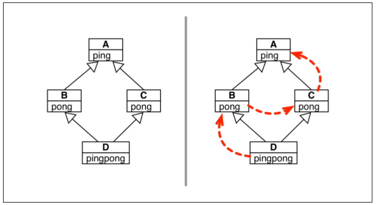
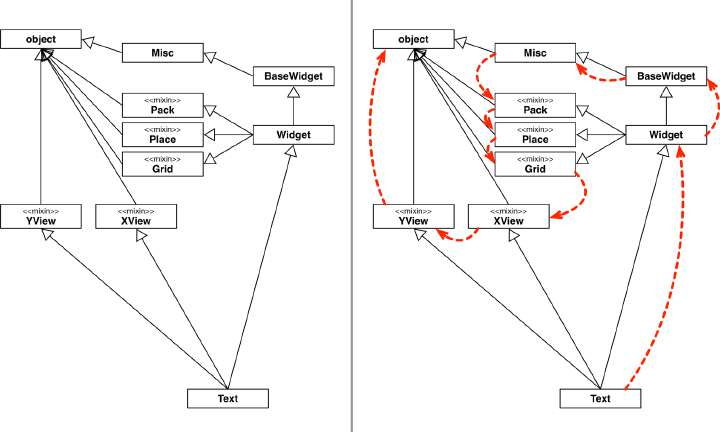

## Chapter 12: Inheritance - For Good or For Worse

Chương này tập trung nói về thừa kế trong Python với hai khía cạnh chính:
-   Những vấn đề gặp phải khi thừa kế các kiểu built-in
-   Đa kế thừa và thứ tự phân giải phương thức

Rất nhiều người cho rằng đa kế thừa có hại nhiều hơn là lợi. Java không có đa kế thừa cũng chẳng sao, thậm chí nó còn giúp giải quyết những cơn đau đầu gây ra bởi lạm dụng đa kế thừa trong C++.

Tuy nhiên, sự thành công vượt trội của Java làm nhiều lập trình viên khi đến với Python chưa từng biết đến đa kế thừa trong thực tế. Vì lẽ đó, các ví dụ trong chương này sẽ thiết thực hơn, chúng ta sẽ làm quen với hai project Python lớn: Tkinter GUI toolkit và Django Web framework.

Ta sẽ bắt đầu bằng cách nêu ra vấn đề với việc thừa kế kiểu built-in. Phần còn lại của chương sẽ tập trung vào đa kế thừa cũng như các case-study và các lời khuyên trong việc xây dựng cây thừa kế trong Python.

---
###  Table of Contents
- [Chapter 12: Inheritance - For Good or For Worse](#chapter-12-inheritance---for-good-or-for-worse)
  - [Table of Contents](#table-of-contents)
  - [Subclassing Built in Types is Tricky](#subclassing-built-in-types-is-tricky)
  - [Multiple Inheritance and Method Resolution Order](#multiple-inheritance-and-method-resolution-order)
  - [Multiple Inheritance in The Real World](#multiple-inheritance-in-the-real-world)
  - [Coping with Multiple Inheritance](#coping-with-multiple-inheritance)
  - [Mixins in Django Generic Views](#mixins-in-django-generic-views)
  - [Soap box](#soap-box)
    - [Think About the Classes You Really Need](#think-about-the-classes-you-really-need)
    - [Misbehaving built-ins: bug or feature?](#misbehaving-built-ins-bug-or-feature)
    - [Inheritance Across Languages](#inheritance-across-languages)

---
###  Subclassing Built in Types is Tricky

Python implementation phổ biến nhất hiện nay là CPython. Đối với CPython, các kiểu built-in được code bằng C thay vì Python. Tuy nhiên, cách implement của CPython tồn tại "bug" khi thừa kế một kiểu built-in: Các phương thức được người dùng ghi đè trên lớp con sẽ không được gọi bởi các phương thức khác trên lớp built-in.

Ví dụ ghi đè `__setitem__` từ lớp con của `dict`:
```python
>>> class DoppelDict(dict):
...     def __setitem__(self, key, value):
...         super().__setitem__(key, value*2)
... 
>>> dd = DoppelDict(one=1)
>>> dd
{'one': 1}
>>> dd['two'] = 2
>>> dd
{'one': 1, 'two': 4}
>>> dd.update(three=3)
>>> dd
{'one': 1, 'two': 4, 'three': 3}
```

*Nhận xét:*
-   Khi khởi tạo đối tượng `dd`, `__init__` không gọi đến `DoppelDict.__setitem__` mà vẫn gọi đến `dict.__setitem__`
-   Khi dùng cú pháp ngoặc vuông, `DoppelDict.__setitem__` được gọi như mong đợi
-   Khi dùng phương thức `update`, CPython lại không gọi đến `DoppelDict.__setitem__`

Vì sự thiếu nhất quán như trên, bạn không nên thừa kế trực tiếp từ một kiểu built-in. Nếu thực sự cần, hãy thừa kế `UserList`, `UserDict` hay `UserString` cho mục đích của bạn.

Hoặc là hãy dùng PyPy thay vì CPython.

---
###  Multiple Inheritance and Method Resolution Order

Đa thừa kế dẫn tới nguy cơ tiềm ẩn xung đột tên thuộc tính và phương thức giữa các class tổ tiên, vấn đề này thường được gọi với tên "diamond problem". Ví dụ:

```python
class A(object):
    def ping(self):
        print('ping:', self)


class B(A):
    def pong(self):
        print('pong:', self)


class C(A):
    def pong(self):
        print('PONG:', self)


class D(B, C):
    def ping(self):
        super().ping()
        print('post-ping:', self)
    
    def pong(self)
        super().pong()
        print('post-pong:', self)
```

Phả hệ hình kim cương và thứ tự phân giải phương thức trong ví dụ trên:



*Chú ý:*
-   Nếu ta gọi phương thức `pong` tại một thể hiện của lớp D, phương thức `pong` của lớp B sẽ được gọi tới vì nó được khai báo trước trong chữ ký lớp của D:
    ```python
    >>> D().pong()
    pong: <__main__.D object at 0x7f279663bdd8>
    ```
-   Nếu muốn chủ động gọi phương thức `pong` từ lớp C với thể hiện của lớp D, hãy dùng cú pháp:
    ```python
    >>> C.pong(D())
    PONG: <__main__.D object at 0x7f279663be10>
    ```
-   Khi gọi đến một phương thức không được implement ở lớp hiện tại, Python bắt đầu tìm kiếm phương thức đó tại các lớp trên cây phả hệ của lớp này theo một thứ tự nhất định. Thứ tự này nằm trong trường thuộc tính `__mro__`:
    ```python
    >>> D.__mro__
    (<class '__main__.D'>, <class '__main__.B'>, <class '__main__.C'>, <class '__main__.A'>, <class 'object'>)
    ```
-   Khi cần gọi đến một phương thức nào đó ở một trong các lớp tổ tiên, cách được đề xuất là sử dụng `super()`, hạn chế việc 'hard-code' `C.ping(self)`
-   `super()` và `self` cùng duyệt qua các lớp trong danh sách `__mro__` để quyết định việc thực hiện lời gọi phương thức ở lớp nào. Điểm khác biệt là `super()` bỏ qua lớp hiện tại trong khi `self` có kiểm tra việc lớp hiện tại có implement phương thức này hay không

Như vậy, diamond problem được xử lý bằng cách gọi phương thức trên lớp đầu tiên xuất hiện trong danh sách MRO. MRO sử dụng thuật toán phân giải thứ tự các lớp từ đồ thị thừa kế có tên là **C3**, bạn đọc có thể tìm hiểu thêm tại [đây](https://www.python.org/download/releases/2.3/mro/).

Để kết thúc mục này, ta sẽ quan sát ví dụ về phân giải thứ tự các lớp trên đồ thị thừa kế của class `Text` trong `Tkinter`:



---
###  Multiple Inheritance in The Real World

Đa kế thừa hoàn toàn có thể có tác dụng trong các bài toán thực tế. Adapter là design pattern sử dụng đa kế thừa, nên chắc chắn nó phải có tác dụng nào đó (tất cả các design pattern còn lại đều dùng đơn kế thừa, nên chắc chắn nó cũng không phải công cụ giải quyết được hết các vấn đề).

Ví dụ dễ thấy nhất về đa kế thừa trong thư viện chuẩn của Python là `collections.abc`. Nhưng thực ra quan hệ kế thừa của các lớp trong package này bản chất là quan hệ implement interface thì đúng hơn, mặc dù bên cạnh việc implement abstract interface, `ABC` còn có thêm khả năng tái sử dụng các phương thức mặc định bên cạnh việc định nghĩa các abstract methods.

Ví dụ khác là `Tkinter` - một package phục vụ lập trình giao diện người dùng phổ biến. Nó sở hữu đồ thị thừa kế khá đồ sộ:


---
###  Coping with Multiple Inheritance

Đa thừa kế về bản chất là phức tạp. Để tránh việc tạo ra một đồ thị thừa kế rối rắm và không nhất quán, cần chú ý các điều sau:
1.  Phân biệt rõ ràng giữa thừa kế để implement interface và thừa kế thuần (chỉ nhằm mục đích tái sử dụng code). Java giúp làm điều này tốt hơn khi tách biệt khái niệm interfaces và classes, còn Python thì không. Nếu thừa kế vì mục đích thứ nhất, hãy đảm bảo rằng interface - xương sống của framework được thiết kế một cách gọn gàng và trong sáng. Nếu thừa kế vì mục đích thứ hai, hãy chắc chắn rằng việc làm này là cần thiết.
2.  Implement interface một cách công khai và rõ ràng thông qua ABCs
3.  Code reuse sử dụng mixin classes. Một mixin là một class implement các phương thức có thể dùng cho các lớp con độc lập. Mixins không chứa các thuộc tính (trừ hằng số) và vì thế không nên khởi tạo đối tượng từ mixin, cũng như không nên tạo class chỉ thừa kế từ mixins. Cuối cùng, mỗi mixin chỉ nên cung cấp một hành vi hoặc cùng lắm là một vài hành vi liên quan chặt chẽ với nhau thông qua methods.
5.  Đặt tên rõ ràng cho mixin với hậu tố `...Mixin`
6.  Không thừa kế nhiều hơn một lớp cụ thể: Một lớp bất kỳ chỉ nên có tối đa một lớp cha không phải là ABC hoặc mixin
7.  Tạo ra các lớp tổng hợp: Một lớp tổng hợp là lớp thừa kế các ABCs hoặc mixins liên quan với nhau cùng phối hợp thực hiện một tác vụ nào đó. Người dùng sử dụng các lớp này không cần phải nhớ hết các ABCs hoặc mixins cần thiết. Đây là ví dụ về lớp `Widget` của `Tkinter`:
    ```python
    class Widget(BaseWidget, Pack, Place, Grid):
        """Internal class.
        Base class for a widget which can be positioned with the
        geometry managers Pack, Place or Grid."""
        pass
    ```
    => `Widget` chỉ có nhiệm vụ gom nhóm, không chứa nội dung nào khác
8.  Luôn ưu tiên cấu thành (composition) hơn thừa kế (inheritance): Nếu muốn tạo ra một sequence, không cần thừa kế list mà hãy tham chiếu đến một thể hiện của list. Cấu thành, đi đôi với ủy nhiệm (delegation) giúp giải quyết vấn đề một cách mềm dẻo, đơn giản và tiết kiệm chi phí hơn thừa kế trong nhiều trường hợp

---
###  Mixins in Django Generic Views

Trong Django, một khung nhìn (view) là một callable object nhận vào tham số là một HTTP request object và trả về một HTTP response object. Responses rất đa dạng, có thể đơn giản là một chuyển hướng (redirect response) với nội dung rỗng, hoặc cũng có thể phức tạp như một trang catalog của một cửa hàng trực tuyến, được rendered từ một HTML template chứa nhiều thành phần khác nhau.

Ban đầu, Django cung cấp một tập hợp các hàm, gọi là generic views, implement một vài ca sử dụng phổ biến. Ví dụ, nhiều trang web cần hiển thị ra kết quả tìm kiếm chứa thông tin của nhiều item nằm trên nhiều trang khác nhau, mỗi item lại có một link đến trang chứa thông tin chi tiết của nó. Trong Django, list view và detail view được thiết kế để giải quyết vấn đề này: list view render các kết quả trong khi detail view tạo ra các trang cho từng kết quả.

Tuy nhiên, các generic views này là các hàm, và vì vậy không thể mở rộng được. Nếu như bạn muốn làm thứ gì đó tương tự nhưng khác một chút với chúng, bạn sẽ phải code lại từ đầu.

Kể từ Django 1.3, khái niệm class-based view xuất hiện, đi kèm với hàng loạt view classes, bao gồm là base classes, mixins hoặc các concrete classes đã sẵn sàng được sử dụng. Các lớp này được định nghĩa trong package `django.views.generic`, module `base`. Dưới đây là biểu đồ UML mô tả các class nằm trong module này:


Hai lớp trên cùng trong biểu đồ này là `View` và `TemplateResponseMixin`, thực hiện hai nhiệm vụ khác nhau.

`View` là lớp cơ sở cho tất cả các views, cung cấp một vài phương thức được định nghĩa sẵn. Ở đây ta sẽ nói đến phương thức `dispatch()`. Nhiệm vụ của nó là gọi đến các phương thức handler như `get`, `head` hay `post` ở các lớp con để xử lý các HTTP request tương ứng. Câu hỏi là tại sao các phương thức handler không phải là abstract method trong interface View? Lý do là bởi các lớp con có thể không implement hết các phương thức này. Ví dụ `TemplateView` chỉ implement `get`, nếu người dùng gửi GET request, `dispatch` có thể gọi đến `get` để trả về kết quả, nhưng nếu họ gửi POST request, `dispatch` sẽ phát hiện phương thức `post` không được implement và trả về response `405 Method Not Allowed`.

`TemplateResponseMixin` cung cấp chức năng cho các views sử dụng template. `RedirectView` không có content body nên không cần thừa kế `TemplateResponseMixin`, nhưng `TemplateView`, `ListView`, `DetailView`, v.v. thì cần thừa kế mixin này.

Giờ ta sẽ đi sâu hơn một chút để tìm hiểu về `ListView`:


`ListView` bản thân nó là một lớp tổng hợp với body chỉ chứa docstring. Khi khởi tạo, `ListView` instance chứa thuộc tính `object_list` mà qua đó, template có thể duyệt để sinh ra nội dung trang. Trong đó, cơ chế truy vấn tạo ra `object_list` cũng như phân trang kết quả được implement trong `MultipleObjetMixin`, còn cơ chế parse template từ `object_list` được implement trong `MultipleObjectTemplateResponseMixin`.

Nếu người dùng chỉ muốn trả về `objec_list` dưới dạng JSON mà không truyền kết quả qua template engine, họ chỉ cần sử dụng đối tượng `BaseListView` là đủ.

Cách thiết kế đa thừa kế của class-based views trong Django là tốt hơn thiết kế của Tkinter vì các lớp được định nghĩa chức năng rõ ràng, và các lớp mixin đều được đặt tên với hậu tố `...Mixin`.

Class-based views đôi khi không được tận dụng đúng cách bởi lập trình viên Django, nhiều người vẫn chỉ sử dụng chúng như là blackbox, và mỗi khi muốn làm gì đó mới, họ lại đi viết những monolithic view functions làm lại những gì mà base views và mixins đã làm. Việc hiểu và tận dụng tốt class-based views không chỉ giúp rút ngắn thời gian phát triển bằng cách tái sử dụng, nó còn giúp giao tiếp giữa các thành viên trở nên rõ ràng hơn bằng việc sử dụng chung ngôn ngữ trong việc đặt tên cho các biến và template.

---
###  Soap box

#### Think About the Classes You Really Need

Bạn sẽ thường xuyên xây dựng ứng dụng hơn là framework, và ngay cả khi xây dựng framework, bạn sẽ dành nhiều thời gian để sử dụng thay vì triển khai lớp. Bởi vậy, nếu bạn bắt gặp mình đang dành nhiều thời gian để implement classes với các mối quan hệ thừa kế lằng nhằng thì tức là bạn đang làm sai:
-   Có thể bạn quá lạm dụng thừa kế mà bỏ quên đi nguyên lý cấu thành và ủy nhiệm
-   Có thể bạn đang phát minh lại cái bánh xe: ai đó đã làm điều này rồi. Hãy kiểm tra xem framework hiện tại có chức năng đó không, nếu không thì tìm framework khác
-   Trường hợp hãn hữu chưa có ai từng thiết kế chức năng này trong framework nào, lúc này bạn mới cần phải tự mình xây dựng chúng

#### Misbehaving built-ins: bug or feature?

Python không quan tâm đến những thay đổi mà bạn tạo ra khi override phương thức của kiểu built-in, bởi vì chúng đã được tối ưu nhất có thể để có tính linh hoạt và hiệu năng cao. Nếu muốn, bạn có thể thừa kế từ các lớp `UserDict`, `UserList` và `UserString` để phục vụ cho bài toán của mình, nhưng hãy nhớ rằng bạn đang đánh đổi hiệu năng lấy khả năng mở rộng khi không dùng các kiểu built-in.

#### Inheritance Across Languages

Ngôn ngữ đầu tiên phổ biến nhất sử dụng đa kế thừa là C++, nhưng tính năng này rất phức tạp và dễ bị lạm dụng.

Java rút kinh nghiệm điều này và chỉ hỗ trợ đơn kế thừa. Kể từ Java 8 với sự xuất hiện của default method đã khiến cho Java interface trở nên rất tương đồng với mixins.

Các ngôn ngữ đơn kế thừa như PHP hay Scala sử dụng "traits" để thay thế cho khái niệm mixin. Tương tự như mixin, traits chỉ định nghĩa một tập hợp các hàm nào đó có thể được sử dụng cho nhiều dạng đối tượng khác nhau và không thể khởi tạo đối tượng từ traits. Điểm khác biệt là mixin trong Python chỉ mang tính conventional (hoàn toàn không có gì khác biệt với một lớp thông thường) trong khi PHP có hẳn từ khóa để định nghĩa (`trait`) và sử dụng (`use`) traits cũng như có các ràng buộc chặt chẽ đối với traits.

Ruby không hỗ trợ đa kế thừa nhưng có khái niệm mixin. Một class Ruby có thể include một module bên trong nó, khiến cho các phương thức định nghĩa bởi module này trở thành một phần của class implementation.

Go không có khái niệm thừa kế, chỉ có khái niệm interface implementation.

Julia thay khái niệm `class` bằng `type`, các subtype chỉ thừa kế hành vi chứ không thừa kế các thuộc tính từ type cha (chỉ abstract types mới có thể được kế thừa).
