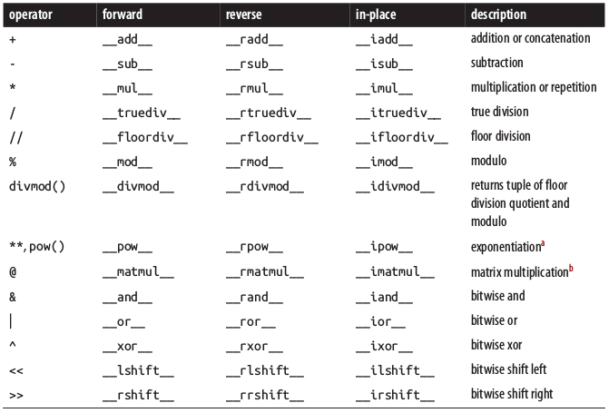
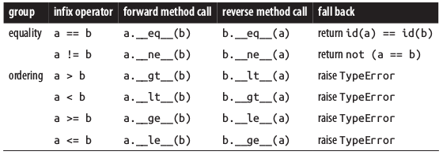

## Chapter 13: Operator Overloading - Doing It Right

Operator overloading (nạp chồng toán tử) cho phép các đối tượng định nghĩa bởi người dùng có khả năng hoạt động với các toán tử hai ngôi như `+` hay `|` và các toán tử một ngôi như `-` hay `~`. Bản chất các cú pháp gọi hàm (`()`), truy cập thuộc tính (`.`), hay truy cập phần tử/slicing (`[]`) cũng là các toán tử trong Python. Tuy nhiên nội dung chương này chỉ bàn đến các toán tử một ngôi và hai ngôi mà thôi.

Trong [Chương 1](../p1-prologue/c1-the-python-data-model.md#how-special-methods-are-used), ta đã thử overloading các toán tử `+` và `*` để tính tổng hai vector và nhân vector với một số. Tuy nhiên, trong ví dụ đó còn nhiều điểm mà ta bỏ qua, chương này sẽ làm rõ hơn về những vấn đề bao gồm:
-   Cách Python hỗ trợ toán tử hai ngôi với hai đối tượng khác kiểu
-   Sử dụng duck typing hoặc type check để hỗ trợ toán tử với nhiều kiểu khác nhau
-   Xử lý ngoại lệ khi implement toán tử
-   Những tính chất đặc biệt của các toán tử so sánh

---
### Table of Contents
- [Chapter 13: Operator Overloading - Doing It Right](#chapter-13-operator-overloading---doing-it-right)
  - [Table of Contents](#table-of-contents)
  - [Operator Overloading 101](#operator-overloading-101)
  - [Unary Operator](#unary-operator)
  - [Vector Addition Example](#vector-addition-example)
  - [Vector Multiplication](#vector-multiplication)
  - [Rich Comparison Operators](#rich-comparison-operators)
  - [Augmented Assignment Operators](#augmented-assignment-operators)
  - [Summary](#summary)
  - [Soapbox](#soapbox)
    - [Operator overloading: pros and cons](#operator-overloading-pros-and-cons)

---
###  Operator Overloading 101

Sử dụng operator overloading không đúng cách có thể dẫn đến các tác dụng phụ như nhầm lẫn, bug và tạo ra các nút thắt cổ chai trong hiệu suất của toàn bộ hệ thống. Python tạo ra sự cân bằng giữa tính mềm dẻo, tính khả dụng và tính an toàn bằng cách đưa ra các ràng buộc cho thao tác đa năng hóa toán tử:
-   Không thể overload toán tử cho các kiểu built-ins
-   Không thể tạo ra toán tử mới, chỉ có thể overload những cái có sẵn
-   Một vài toán tử không thể được overload, đó là `is`, `and`, `or` và `not` (lưu ý vẫn có thể overload các toán tử bitwise `&`, `|`, `~`)

---
###  Unary Operator

Ba toán tử một ngôi trong Python là:
-   `__neg__`: Số đối (-)
-   `__pos__`: Số dương (+), trong hầu hết các trường hợp `+x == x`, các ngoại lệ rất hiếm gặp
-   `__invert__`: Bitwise inverse (~), nếu x là số nguyên thì `~x == -(x+1)`

Chú ý rằng, luôn trả về một đối tượng mới khác `self` khi implement các toán tử một ngôi.

---
###  Vector Addition Example

Trước khi cài đặt, hãy cân nhắc các yêu cầu cần thiết cho phép cộng hai vector:
-   Tổng của hai vector là vector tổng các thành phần
-   Khi tính tổng hai vector có độ dài khác nhau, nên coi các phần tử cuối của vector ngắn hơn bằng 0
-   Luôn trả về vector mới

Bây giờ, hãy implement phương thức `__add__` theo yêu cầu trên cho lớp `Vector`

```python
class Vector(object):
    ...
    def __add__(self, other):
        pairs = itertools.zip_longest(self, other, fillvalue=0.0)
        return Vector(a + b for a, b in pairs)
```

*Mẹo:*
-   `itertools.zip_longest` sẽ zip theo sequence dài nhất trong số các chuỗi được truyền vào, option `fillvalue` định nghĩa giá trị được điền vào các chuỗi ngắn hơn để thu được các chuỗi có cùng độ dài.

Bây giờ ta có thể dùng toán tử + cho hai Vector, thậm chí nó có thể được dùng để tính tổng một vector với một sequence:
```python
>>> x = Vector([1, 2, 3])
>>> y = Vector([4, 5, 6])
>>> x + y
Vector([5.0, 7.0, 9.0])
>>> z = Vector([7, 8, 9, 10])
>>> x + z
Vector([8.0, 10.0, 12.0, 10.0])
>>> x + (1, 2, 3)
Vector([2.0, 4.0, 6.0])
```

Tuy nhiên, ở ví dụ cuối cùng, nếu ta đảo vị trí hai toán hạng thì có lỗi xảy ra:
```python
>>> (1, 2, 3) + x
Traceback (most recent call last):
  File "<stdin>", line 1, in <module>
TypeError: can only concatenate tuple (not "Vector") to tuple
```

Lỗi này sinh ra là bởi vì phép + đối với tuple mang ý nghĩa là nối hai tuple với nhau và không được dùng cho kiểu dữ liệu khác.

*Chú ý:* Luồng tính toán biểu thức `a + b`:
1.  Nếu `a` có phương thức `__add__` thì biểu thức `a.__add__(b)` được gọi
1.  Nếu `b` có pương thức `__radd__` thì biểu thức `b.__radd__(a)` được gọi
1.  Trường hợp còn lại, ngoại lệ `TypeError` sẽ được tung ra

Phép `__radd__` được hiểu là `reversed add`, nên implement phương thức này để đảm bảo rằng phép cộng vẫn thực hiện đúng khi biểu thức được giao hoán:
```python
def __radd__(self, other):
    return self + other
```

Lỗi `TypeError` khi cộng `tuple` và `Vector` đã được giải quyết:
```python
>>> x = Vector([1, 2, 3])
>>> (1, 2, 3) + x
Vector([2.0, 4.0, 6.0])
```

Rất nhiều toán tử trung tố có phiên bản "reversed" (`__rsub__`, `__rmul__`, `__rmod__`, ...), implement các toán tử này giúp thực hiện phép toán trung tố giữa thể hiện của lớp hiện tại và một lớp khác theo cả thứ tự xuôi và ngược. Tất nhiên, nhiều phép toán trung tố không có tính chất giao hoán, có nghĩa là đôi khi ta phải implement phương thức "reversed" phức tạp hơn `__radd__` như trên.

Phương thức `__add__` của Vector chỉ giúp cộng một vector với một sequence, hạng tử thứ hai không thể là kiểu số hay kiểu `str`. Tuy nhiên, thông điệp báo lỗi của nó rất vô ích:

```python
>>> x = Vector([1, 2, 3])
>>> x + 1
Traceback (most recent call last):
  File "<stdin>", line 1, in <module>
  File "c10.py", line 105, in __add__
    pairs = itertools.zip_longest(self, other, fillvalue=0.0)
TypeError: zip_longest argument #2 must support iteration
```

Thay vì ngoại lệ `TypeError` khó hiểu, ta muốn trả về một ngoại lệ `NotImplemented` thông báo rằng phép cộng giữa Vector và `int` chưa được định nghĩa, làm như vậy sẽ hữu dụng hơn nhiều:
```python
def __add__(self, other):
    try:
        pairs = itertools.zip_longest(self, other, fillvalue=0.0)
        return Vector(a + b for a, b in pairs)
    except TypeError:
        return NotImplemented
...
>>> x = Vector([1, 2, 3])
>>> x + 1
Traceback (most recent call last):
  File "<stdin>", line 1, in <module>
TypeError: unsupported operand type(s) for +: 'Vector' and 'int'
```

Hơn nữa, khi bắt được ngoại lệ `NotImplemented`, Python sẽ chủ động thử dùng phương thức "reversed" của toán hạng thứ hai để tiếp tục phép toán, hơn là quăng ngoại lệ và kết thúc như `TypeError`.

---
###  Vector Multiplication

Định nghĩa phép nhân vector với một số vô hướng tương đối đơn giản:

```python
def __mul__(self, scalar):
    return Vector(n * scalar for n in self)

def __rmul__(self, scalar):
    return self * scalar
```

`scalar` chỉ có thể là số kiểu thực, nên kiểm tra điều này trước:

```python
def __mul__(self, scalar):
    if isinstance(self, numbers.Real):
        return Vector(n * scalar for n in self)
    else:
        return NotImplemented
```

Dưới đây là bảng toán tử trung tố mà Python hỗ trợ:



Chú ý toán tử `@` là tính năng mới của Python 3.5, cho phép thực hiện overload phép nhân vô hướng hai vector hoặc phép nhân hai ma trận. Hãy thử implement phép nhân vô hướng hai `Vector` sử dụng toán tử `@` xem sao:
```python
    def __matmul__(self, other):
        try:
            return sum(a * b for a, b in zip(self, other))
        except TypeError:
            return NotImplemented

    def __rmatmul__(self, other):
        return self @ other
```

Giờ ta có thể nhân tích vô hướng của hai vector với nhau rồi:
```python
>>> va = Vector([1, 2, 3])
>>> vz = Vector([5, 6, 7])
>>> va @ vz
38.0
>>> [10, 20, 30] @ vz
380.0
>>> va @ 3
Traceback (most recent call last):
  ...
  TypeError: unsupported operand type(s) for @: 'Vector' and 'int'
```

---
###  Rich Comparison Operators

Các toán tử so sánh trong Python cũng được implement tương tự các toán tử tính toán trung tố ở trên, với hai điểm khác biệt chính:
-   Phương thức `reverse` được implement theo quy tắc được cho bởi bảng dưới
    
-   Trường hợp so sánh bằng nhau, phép toán fall back cuối cùng là so sánh id của hai đối tượng. Trường hợp so sánh khác nhau sẽ fall back về phép "không" bằng nhau (`not(a==b)`), do vậy ta không thực sự cần phải overload toán tử `!=`. Các trường hợp còn lại trả về `TypeError`
-   Thật là vô nghĩa khi so sánh hai đối tượng khác kiểu nhau, bởi vậy hãy kiểm tra kiểu của đối tượng `other` trước khi implement phép so sánh bằng hàm `isinstance`

Hãy thử implement toán tử so sánh "=" cho hai đối tượng `Vector`:
```python
    def __eq__(self, other):
        if isinstance(other, Vector):
            return (len(self) == len(other) and
                    all(a == b for a, b in zip(self, other)))
        
        return NotImplemented
```

Ta đã có thể so sánh hai đối tượng `Vector` bất kỳ:
```python
>>> va = Vector([1.0, 2.0, 3.0])
>>> vb = Vector(range(1, 4))
>>> va == vb
True
>>> t3 = (1, 2, 3)
>>> va == t3
False
```

*Chú ý:*
-   Khi so sánh `Vector` với `tuple`, cả hai phương thức `va.__eq__(t3)` và `t3.__eq__(va)` đều trả về `NotImplemented`, khi đó Python so sánh `id` của hai đối tượng này và trả về `False` thay vì raise exception


---
###  Augmented Assignment Operators

Lớp `Vector` đã được overload phép `+` và `*`, khiến ta cũng dùng được phép `+=` và `*=` với nó luôn. Điều này là bởi vì Python tự động chuyển phép toán `a += b` thành `a = a + b`, tức là `a` đã bị gán lại cho một đối tượng mới được tạo ra:
-   Nếu `a` là immutable, hành vi này là đúng như mong đợi. Bởi vậy ta không cần, cũng không nên định nghĩa lại các toán tử `in place` như `__iadd__`, `__imul__`, `__idiv__`, ... cho các kiểu immutable
-   Nếu `a` là mutable, ta sẽ mong đợi việc thay đổi giá trị của `a` tại chỗ thay vì tạo ra đối tượng mới, bởi vậy hành vi mặc định này là không phù hợp. Lúc này ta cần implement các toán tử `in place` bằng cách sửa đổi `self` và trả về chính nó

---
### Summary

Nội dung chương này bắt đầu bằng các ràng buộc khi đa năng hóa toán tử trong Python. Sau đó ta lần lượt làm quen với các ví dụ implement các toán tử một ngôi, toán tử hai ngôi, toán tử so sánh và các toán tử tại chỗ thông qua những ví dụ đơn giản.

---
###  Soapbox

#### Operator overloading: pros and cons

-   James Gosling, người sáng lập ra Java đã quyết định không cho Java khả năng đa năng hóa toán tử, lý do ông đưa ra là bởi vì nó gây ra sự nhầm lẫn khó hiểu cho người sử dụng toán tử đã được overload, hơn nữa việc ai cũng có thể định nghĩa bất cứ toán tử nào sẽ dẫn đến sự hỗn loạn và thiếu nhất quán
-   Python tất nhiên đã có những giới hạn nhằm tránh việc đa năng hóa toán tử tùy tiện và nó đem lại lợi ích rất lớn. Một trong số đó là tính khả đọc được cải thiện đáng kể. Ví dụ về phép tính lãi trong Python được implement đơn giản hơn rất nhiều so với Java:
    -   Trong Python:
        ```python
        interest = principal * ((1 + rate) ** periods - 1)  # with all kinds of numbers that inherit from numbers.Real

    -   Trong Java:
        ```java
        // Simple float or double
        float interest = principal * (Math.pow(1 + rate, periods) - 1);

        // whereas other kinds of number don't have that pretty look
        BigDecimal interest = principal.multiply(BigDecimal.ONE.add(rate).pow(periods).subtract(BigDecimal.ONE));
        ```
-   Có thể nói, việc hỗ trợ rất tốt cho đa năng hóa toán tử là tính năng quan trọng giúp Python trở thành ngôn ngữ được lựa chọn để xây dựng nhiều thư viện tính toán khoa học và trở nên phổ biến nhất trong các lĩnh vực tính toán và đặc biệt là trí tuệ nhân tạo

