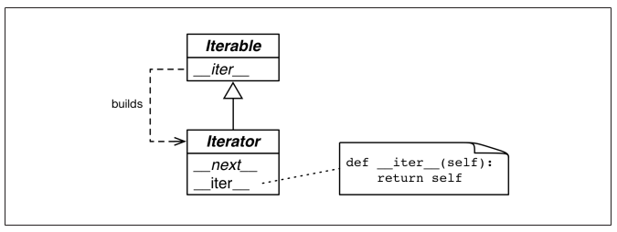

## Iterables, Iterators and Generators

Iteration là một ý tưởng cơ bản trong xử lý dữ liệu: Khi dataset trở nên quá lớn để nạp hết vào bộ nhớ, ta phải đọc từng item một và chỉ đọc khi được yêu cầu. Đây cũng chính là ý tưởng của Iterator design pattern, cũng là chủ đề chính của chương này.

Key word `yield` là từ khóa giúp khởi tạo ra generators, hay chính là các iterators. Theo định nghĩa, tất cả các generators đều là iterator, điểm khác biệt là iterators có chức năng *lấy* items từ một tập hợp có trước, trong khi generator *tạo ra* các items "từ không khí" (out of thin air). Tuy nhiên, trong hầu hết các trường hợp, cộng đồng Python đều coi như generators và iterators là đồng nghĩa.

Tất cả collection trong Python đều là iterable, và các iterators được dùng để hỗ trợ cho các thao tác:
-   Lặp với `for`
-   Khởi tạo và mở rộng các collections
-   Duyệt text files theo dòng
-   `list`, `dict` và `set` comprehensions
-   `tuple` unpacking
-   unpack tham số truyền vào hàm với toán tử `*`

Nội dung chương này bao gồm các chủ đề sau:
-   Cách mà `iter()` xử lý các iterable objects
-   Cách implement Iterator pattern cổ điển trong Python
-   Cách hoạt động của generator function
-   Cách thay thế Iterator cổ điển bằng generator function hoặc generator expression
-   Sử dụng cách generator functions có sẵn trong thư viện chuẩn
-   Sử dụng cú pháp `yield from` để gộp các generator
-   Phân biệt generators và coroutines

---
### Table of Contents

- [Iterables, Iterators and Generators](#iterables-iterators-and-generators)
  - [Table of Contents](#table-of-contents)
  - [A Sequence of Words](#a-sequence-of-words)
    - [Why Sequences Are Iterable: The iter Function](#why-sequences-are-iterable-the-iter-function)
  - [Iterables vs Iterators](#iterables-vs-iterators)
  - [A Classic Iterator](#a-classic-iterator)
    - [Making Sentence an Iterator: Bad Idea](#making-sentence-an-iterator-bad-idea)
  - [A Generator Function](#a-generator-function)
    - [How Generator Functions Work](#how-generator-functions-work)
  - [A Lazy Implementation](#a-lazy-implementation)
  - [A Generator Expression](#a-generator-expression)
  - [Generator Expressions: When to Use Them](#generator-expressions-when-to-use-them)
  - [Arithmetic Progression Generator Example](#arithmetic-progression-generator-example)
    - [Arithmetic Progression with itertools](#arithmetic-progression-with-itertools)
  - [Generator Functions in The Standard Library](#generator-functions-in-the-standard-library)
  - [The yield from Syntax](#the-yield-from-syntax)
  - [Iterable Reducing Functions](#iterable-reducing-functions)
  - [A Closer Look at The iter Function](#a-closer-look-at-the-iter-function)
  - [Generators as Coroutines](#generators-as-coroutines)
  - [Summary](#summary)
  - [Soapbox](#soapbox)
    - [Generator Function Syntax: More Sugar Would Be Nice](#generator-function-syntax-more-sugar-would-be-nice)
    - [Semantics of Generator vs Iterator](#semantics-of-generator-vs-iterator)
    - [The Minimalistic Iterator Interface in Python](#the-minimalistic-iterator-interface-in-python)

---
### A Sequence of Words

Trước tiên, ta sẽ implement một class `Sentence` là một sequence của các `words` sử dụng sequence protocol:

```python
import re
import reprlib

RE_WORD = re.compile('\w+')


class Sentence(object):

    def __init__(self, text):
        self.text = text
        self.words = RE_WORD.findall(text)

    def __getitem__(self, index):
        return self.words[index]

    def __len__(self):
        return len(self.words)

    def __repr__(self):
        return 'Sentence(%s)' % reprlib.repr(self.text)
```

*Chú ý:*
-   `re` là module giúp thao tác với regular expressions của Python
    -   `\w` tương đương với `[a-zA-Z0-9_]`
    -   `re.compile(str)`: tạo ra đối tượng lưu trữ pattern là xâu được truyền vào
    -   `RE_WORD.findall(text)`: trả về danh sách các kết quả thỏa mãn pattern lưu bởi `RE_WORD` không giẫm lên nhau trong xâu `text`
-   Sequence protocol yêu cầu implement cả `__getitem__` và `__len__`, nhưng để tạo ra iterators thì chỉ cần `__getitem__`

Giờ ta có thể sử dụng Sentence như là một sequence:

```python
>>> sentence = Sentence('"The time has come," the Walrus said,')
>>> for word in sentence:
...     print(word)
... 
The
time
has
come
the
Walrus
said
>>> x, y, z, *_ = sentence
>>> x, y, z
('The', 'time', 'has')
>>> list(sentence)
['The', 'time', 'has', 'come', 'the', 'Walrus', 'said']
>>> print(*sentence, sep=', ')
The, time, has, come, the, Walrus, said
```

#### Why Sequences Are Iterable: The iter Function

Mỗi khi trình thông dịch cần duyệt qua một object `x`, nó sẽ gọi hàm `iter(x)`. Hàm này thực hiện các thao tác sau:
-   Kiểm tra xem đối tượng có implement `__iter__` không, nếu có thì gọi đến phương thức đó để lấy về một iterator
-   Nếu `__iter__` không được implement nhưng `__getitem__` có, Python tạo ra một iterator và đọc từng item của object một cách lần lượt, bắt đầu từ 0
-   Trường hợp còn lại, raise `TypeError`, báo rằng đối tượng không là iterable

Bởi vì sequence được implement `__getitem__` nên chúng đều là iterable. Thực tế, các standard sequence implement `__iter__` và bạn cũng nên làm điều đó. Việc fallback về `__getitem__` chỉ để phục vụ tương thích ngược và tính năng này có thể sẽ không còn trong các phiên bản Python trong tương lai.

Đây chính là hành vi "duck typing" điển hình: Nếu có thể gọi `iter()` trên một đối tượng, đối tượng đó là iterable, bất chấp việc có thể nó không được implement phương thức `__iter__`. Nếu muốn ràng buộc chặt chẽ đối tượng phải được implement `__iter__`, hãy dùng cú pháp "goose typing":

```python
>>> issubclass(Sentence, abc.Iterable)
False
```

Tuy nhiên, cách làm tốt nhất vẫn là sử dụng khối `try...except` để bắt `TypeError` khi không thể gọi `iter()` trên đối tượng.

---
### Iterables vs Iterators

-   Iterator là con chạy được dùng để duyệt qua một collection
-   Iterable là đối tượng có thể được truyền vào hàm `iter()` để trả về một *iterator*

`str` cũng là iterable, dưới đây là cú pháp duyệt qua một xâu:

```python
s = 'ABC'
for char in s:
        print(char)
```

Cú pháp này được dịch sang thành:

```python
s = 'ABC'
it = iter(s)
while True:
    try:
        print(next(it))
    except StopIteration:
        del it
        break
```

Hàm `next()` được sử dụng để lấy phần tử tiếp theo được sinh ra bởi iterator, nếu không còn phần tử nào nữa, ngoại lệ `StopIteration` sẽ được tung ra.

Dưới đây là biểu đồ UML cho mối quan hệ giữa Iterator và Iterable standard interface trong `collection.abc`:



*Chú ý*: 
-   `__iter__` của một iterator trả về chính nó.
-   Bởi vì chỉ có `__next__` và `__iter__` là hai phương thức bắt buộc đối với iterator nên ta không có cách nào để kiểm tra xem có bao nhiêu phần tử còn lại cũng như không thể reset một iterator (ngoài việc gọi lại hàm `iter(...)` để tạo iterator mới).

Tóm lại, ta có định nghĩa của iterator:

> Iterator là bất kỳ đối tượng nào được impelent phương thức `__next__` không chứa tham số mà trả về phần tử tiếp theo của một chuỗi hoặc tung ngoại lệ `StopIteration` khi không còn phần tử nào khác. Iterator trong Python cũng là iterable vì nó được implement phương thức `__iter__` trả về chính nó. 

---
### A Classic Iterator

Bây giờ, ta hãy implement một iterator tuân theo `Iterator` interface cho class `Sentence`, tên là `SequenceIterator`:

```python
class Sentence:
    ...
    def __iter__(self):
        return SentenceIterator(self.words)

class SentenceIterator:

    def __init__(self, words):
        self.words = words
        self.index = 0

    def __next__(self):
        try:
            word = self.words[self.index]
        except IndexError:
            raise StopIteration()
        self.index += 1
        return word

    def __iter__(self):
        return self
```

*Chú ý:* Bắt ngoại lệ ngay khi nó có thể được sinh ra (như ví dụ trên) giúp quản lý code dễ hơn

#### Making Sentence an Iterator: Bad Idea

Không nên biến một Sequence thành một Iterator. Bạn có thể implement `__next__` cho `Sentence` và giúp nó tự duyệt qua chính nó, nhưng đây hoàn toàn không phải là một ý tưởng hay.

Theo định nghĩa, Iterator design pattern được dùng để:
-   Truy cập đến nội dung của một đối tượng mà không để lộ trạng thái biểu diễn bên trong của nó
-   Hỗ trợ nhiều yêu cầu duyệt nội dung một đối tượng một cách đồng thời
-   Cung cấp một interface thống nhất để duyệt qua các đối tượng có cấu trúc khác nhau

Dễ thấy, việc biến sequence thành iterator phá hỏng cả ba mục đích trên. Đó là lí do cần phải tạo ra một iterator riêng cho class.

---
### A Generator Function

Cách Pythonic nhất để lấy ra một iterator từ một iterable đó là biến phương thức `__iter__` thành một generator function. Dưới đây là ví dụ với lớp `Sentence`:

```python
class Sentence:
    ...
    def __iter__(self):
        for word in self.words:
            yield word
```

Bằng cách này ta không cần bắt ngoại lệ `StopIteration`, cũng không phải định nghĩa lớp `SentenceIterator` nữa.

Tất nhiên ta cũng có thể làm đơn giản hơn với cú pháp `iter(self.words)`, tuy nhiên ở đây tác giả dùng generator để lấy ví dụ giới thiệu tính năng này.

#### How Generator Functions Work

Bất kỳ một hàm nào trong Python mà có từ khóa `yield` ở thân hàm đều là một generator function. Generator function trả về một generator object khi được gọi. Nói cách khác, một generator function là một generator factory. Ví dụ:

```python
>>> def gen_123():
...     yield 1
...     yield 2
...     yield 3
... 
>>> gen_123
<function gen_123 at 0x7f91e22d5ea0>
>>> gen_123()
<generator object gen_123 at 0x7f91e0361a98>
>>> g = gen_123()
>>> next(g)
1
>>> next(g)
2
>>> next(g)
3
>>> next(g)
Traceback (most recent call last):
  File "<stdin>", line 1, in <module>
StopIteration
```

Generator function tạo ra một generator object đóng gói nội dung của chính nó. Khi gọi `next(...)` trên generator object, generator function sẽ được thực thi cho đến khi gặp lệnh `yield`, trả về kết quả của lệnh `yield` và tạm dừng. Quá trình này lặp lại mỗi khi hàm `next()` được gọi trên generator object cho đến khi generator function kết thúc, khi đó, generator object sẽ raise `StopIteration` exception như định nghĩa bởi Iterator protocol.

Bạn đọc có thể nhầm lẫn giữa `yield` và `return` vì chúng đều cho ra một kết quả nào đó, nhưng đối với generator function, hai lệnh này hoàn toàn khác nhau. Generator function luôn "return" một generator object, generator object "yield" ra một kết quả nào đó mỗi khi gọi `next` trên nó. Lệnh generator function gặp lệnh `return`, nó sẽ gây ra `StopIteration` exception bên trong generator object.

Chú ý, ta cũng có thể dùng vòng lặp `for...in` duyệt qua generator, nhưng chỉ có thể duyệt một lần:
```python
>>> g = gen_123()
>>> for i in g:
...     print(i)
... 
1
2
3
>>> next(g)
Traceback (most recent call last):
  File "<stdin>", line 1, in <module>
StopIteration
```

Lý do:
-   Python dịch vòng lặp `for...in` thành vòng lặp `while` sử dụng con chạy là `it=iter(obj)`
-   `iter(generator)` trả về chính `generator` do generator cũng là iterator
-   Do iterator chỉ được duyệt qua một lần nên generator cũng chỉ được duyệt qua một lần

---
### A Lazy Implementation

`Iterator` interface được thiết kế để hoạt động một cách *lazy*: `next(my_iterator)` cho ra một item mỗi lần gọi. Trái ngược với *lazy* là *eager*. Cả *lazy evaluation* và *eager evaluation* đều là những khái niệm quan trọng trong lý thuyết lập trình.

Class `Sentence` hiện tại vẫn chưa được *lazy*. Phương thức `__init__` phải tạo mới một list gồm tất cả các từ trong xâu đầu vào rồi gán nó với thuộc tính `words`. Điều này gây tốn kém không gian lưu trữ, đặc biệt là khi kích thước của xâu đầu vào lớn mà người dùng chỉ cần xử lý một vài phần tử đầu tiên thôi.

Python3 thường luôn có cách *lazy* để giải quyết vấn vấn đề của bạn. Ví dụ `re.finditer()` trả về một generator có khả năng yield ra các `re.MatchObject` khi cần, thay vì trả về tất cả các match objects như hàm `re.findall()`. Nếu có nhiều xâu match, `re.finditer()` sẽ giúp tiết kiệm được rất nhiều bộ nhớ.

Ta sẽ dùng `re.finditer()` để khiến class `Sentence` trở nên *lazy*:
```python
import re
import reprlib

RE_WORD = re.compile('\w+')


class Sentence:

    def __init__(self, text):
        self.text = text

    def __repr__(self):
        return 'Sequence (%s)' % reprlib.repr(self.text)

    def __iter__(self):
        for match in RE_WORD.finditer(self.text):
            yield match.group()
```

*Mẹo:* 
-   Phương thức `match.group()` lấy ra nội dung text được so khớp trong đối tượng `MatchObject`
  
*Nhận xét:*
-   Ta không cần lọc ra tất cả các từ và lưu vào một mảng ngay từ đầu nữa. Thay vào đó, cứ mỗi lần cần lấy ra một từ, ta sẽ trả về nội dung của `match` object tương ứng

Ta vẫn còn có thể làm cho `Sentence` đơn giản hơn với generator expression.

---
### A Generator Expression

Generator expressions có thể được sử dụng để thay thế cho những generator functions đơn giản. Có thể hiểu nó như là phiên bản *lazy* của list comprehension: trả về từng phần tử một mà không phải tạo ra cả một list. Nói cách khác, list comprehension là *factory* của lists, generator expression là *factory* của generators.

```python
...
    def __iter__(self):
        return (match.group() for match in RE_WORD.finditer(self.text))
```

---
### Generator Expressions: When to Use Them

Ưu điểm:
-   Tiết kiệm bộ nhớ hơn list comprehensions
-   Gọn gàng hơn generator functions
-   Dễ đọc, dễ hiểu

Sử dụng generator functions khi:
-   Logic xử lý để tạo generator phức tạp mà không thể biểu diễn trên một dòng
-   Cần sử dụng lại, vì functions có tên cụ thể. Ta cũng có thể dùng lại expressions bằng cách gán nó cho biến nào đó, nhưng nhìn chung cách này không được khuyên dùng

*Mẹo:*
-   Nếu một hàm nào đó nhận duy nhất một tham số một generator, bạn có thể bỏ dấu ngoặc tròn `()` dùng để khởi tạo generator đi:
    ```python
    Vector((i*2 for i in range(10)))
    ```
    có thể viết lại thành:
    ```python
    Vector(i*2 for i in range(10))
    ```
---
### Arithmetic Progression Generator Example

Không chỉ có tác dụng lấy dữ liệu từ một collection, iterators còn có chức năng tạo ra từng phần tử một cách tại chỗ. Ví dụ, hàm `range()` tạo ra một cấp số cộng hữu hạn, hàm `itertools.count` tạo ra một cấp số cộng vô hạn.

Trong ví dụ dưới đây, ta sẽ tạo ra một lớp cấp số cộng `ArithmeticProgression` là sự kết hợp của cả `range` và `itertools.count`: Tham số `end` là optional, nếu `end` là `None`, cấp số là vô hạn, ngược lại thì nó là hữu hạn và giới hạn bởi `end`.
```python
class ArithmeticProgression:

    def __init__(self, begin, step, end=None):
        self.begin = begin
        self.step = step
        self.end = end      # None -> infinite series

    def __iter__(self):
        result = type(self.begin + self.step)(self.begin) #1
        forever = self.end is None
        index = 0
        while forever or result < self.end:
            yield result
            index += 1
            result = self.begin + self.step * index #2
```

*Chú ý*:
-   #1: Khởi tạo giá trị của `result` bằng `begin` và kiểu là kiểu lớn hơn trong hai kiểu của `begin` và `step`
-   #2: Thay vì cộng thêm `step` tại mỗi bước cho `result`, ta tính trực tiếp từ `begin` và `step` để tránh sai số cộng dồn đối với kiểu số thực

Ví dụ sử dụng:

```python
>>> ap = ArithmeticProgression(0, 1, 3)
>>> list(ap)
[0, 1, 2]
>>> ap = ArithmeticProgression(1, .5, 3)
>>> list(ap)
[1.0, 1.5, 2.0, 2.5]
>>> ap = ArithmeticProgression(0, 1/3, 1)
>>> list(ap)
[0.0, 0.3333333333333333, 0.6666666666666666]
>>> from fractions import Fraction
>>> ap = ArithmeticProgression(0, Fraction(1, 3), 1)
>>> list(ap)
[Fraction(0, 1), Fraction(1, 3), Fraction(2, 3)]
>>> from decimal import Decimal
>>> ap = ArithmeticProgression(0, Decimal('.1'), .3)
>>> list(ap)
[Decimal('0.0'), Decimal('0.1'), Decimal('0.2')]
```

Ta có thể viết lại lớp này dưới dạng một generator function đơn giản:

```python
def aritprog_gen(begin, step, end=None):
    result = type(begin+step)(begin)
    forever = end is None
    index = 0
    while forever or end > result:
        yield result
        index += 1
        result = begin + step * index
```

#### Arithmetic Progression with itertools

Module `itertools` (Functions creating iterators for efficient looping) trong Python 3.4 có 19 generator functions có thể kết hợp với nhau một cách thú vị. Danh sách đầy đủ nằm ở [đây](https://docs.python.org/3.6/library/itertools.html), dưới đây là một vài ví dụ:

-   `itertools.count(start, step)`: Tạo một biến đếm chạy đến vô cùng
-   `itertools.takewhile(condition, other_generator)`: Chạy `other_generator` cho đến khi `condition` đạt `False`
-   Kết hợp hai công cụ này để viết hàm cấp số cộng:
    ```python
    def aritprog_gen(begin, step, end=None):
        first = type(begin + step)(begin)
        ap_gen = itertools.count(first, step)
        if end is not None:
            ap_gen = itertools.takewhile(lambda n: n < end, ap_gen)
        return ap_gen
    ```

---
### Generator Functions in The Standard Library

Bộ thư viện chuẩn của Python chứa rất nhiều generators hữu dụng:

-   Phương thức `readline` cho file objects đọc từng dòng của file
-   Hàm `os.walk` yields tên file khi duyệt qua một cây thư mục, giúp cho việc tìm kiếm trên cây thư mục trở nên dễ dàng với vòng lặp for

*Filtering generator functions:*

-   `itertools.compress(it, selector_it)`: yields items của `it` nếu như item tương ứng của `selector_it` là "đúng"
-   `itertools.dropwhile(predicate, it)`: lọc ra các phần tử liên tục đầu tiên mà `predicate` đạt `True`, in ra các phần tử còn lại
    ```python
    >>> list(dropwhile(lambda x: 5 > x, [1, 4, 6, 4, 1]))
    [6, 4, 1]
    ```
-   `filter(predicate, it)`: yields item của `it` nếu `predicate` tại `item` đạt `True`
-   `itertools.filterfalse`: ngược lại với `filter`
-   `itertools.islice`: Iterator slicing, tương tự như list slicing
-   `itertools.takewhile`: Ví dụ ở trên

*Mapping generator functions:*

-   `itertools.accumulate(it, [func])`: yields tổng của n số hạng đầu tiên trong `func(it)`
    ```python
    >>> list(itertools.accumulate([1, 2, 3, 4]))
    [1, 3, 6, 10]
    ```
-   `enumerate(iterable, start=0)`: yields các tuple đôi `(index, item)` từ `iterable`, trong đó index đánh số từ `start`
-   `map(func, it1[, it2, ..., itN])`: Tính `func` trên tham số là các phần tử đọc vào từ cả `it`, yield kết quả
-   `itertools.starmap(func, it)`: Dùng thay `map` nếu `it = zip(it1, it2, ...itN)`

*Generator functions that merge multiple input iterables*

-   `itertools.chain(it1, ..., itN)`: yields tất cả các item từ các `it` nối đuôi nhau
-   `itertools.product(it1, ..., itN)`: yields tích Đề các của các `it` đầu vào
-   `zip(it1, ..., itN)`: zip các itertors
-   `itertools.zip_longest(it1, .., itN, fillvalue=None)`: Tương tự `zip`, nhưng mà zip theo chuỗi dài nhất, các chuỗi ngắn hơn sẽ được tự động điền thêm `fillvalue`

*Generator functions that expand each input item into multiple output items*

-   `itertools.combinations(it, out_len)`: yields các tổ hợp độ dài `out_len` của các phần tử nằm trong `it`
-   `itertools.combinations_with_replacement(it, out_len)`: yields tất cả các tổ hợp lặp độ dài `out_len` của các phần tử nằm trong `it`
-   `itertools.permutations(it, out_len=None)`: yields các chỉnh hợp độ dài `out_len` của các phần tử nằm trong `it`
-   `itertools.count`: Tạo ra biến đếm đến vô cực
-   `itertools.cycle(it)`: yields các phần tử của it từ đầu tới cuối rồi lặp lại vô hạn lần
-   `itertools.repeat(item[, times])`: yields một phần tử vô hạn lần, hoặc đến số lần bằng `times`

*Rearranging generator functions*

-   `itertools.groupby(it, key=None)`: yields các tuple kép `(key, group)`, các phần tử có cùng `key` thì thuộc cùng `group` và `group` cũng là generator yields từng phần tử của nó
-   `reversed(seq)`: yields từng phần tử của sequence theo thứ tự ngược lại
-   `itertools.tee(it, n=2)`: tạo ra tuple của n generator cùng duyệt qua `it`

---
### The yield from Syntax

Từ Python 3.4, cú pháp:

```python
for i in iterable:
    yield i
```
có thể được thay thế bằng một statement duy nhất:

```python
yield from iterable
```
Không chỉ là cách để đơn giản hóa cú pháp cho generator functions, `yield from` còn đóng vai trò quan trọng trong lập trình *coroutine* sexddwowjc bàn tới trong chương 16.

---
### Iterable Reducing Functions

Các hàm tích hợp có thể được sử dụng trên iterable bao gồm: `all`, `any`, `max`, `min`, `sum`, `reduce`

Riêng `sorted` dù nhận đầu vào là iterable bất kỳ nhưng nó sẽ được convert thành list và kết quả trả về cũng là một list (không áp dụng được lazy evaluation).

---
### A Closer Look at The iter Function

`iter()` trả về iterator từ một sequence, ta đã biết điều đó. Tuy nhiên có một usecase khác của nó, đó là trả về iterator từ bất kỳ một callable object nào. Cú pháp của nó là:

```
iter(callable, sentinel) -> iterator
```

Tức là nó sẽ thực hiện gọi `callable` liên tục cho đến khi `callable` trả về giá trị `sentinel`.

Ví dụ, `d6_iter` sẽ trả về số ngẫu nhiên từ 1 đến 6 cho đến khi nó trả về 1 thì dừng (không in ra 1):
```python
>>> def d6():
...     return randint(1, 6)
>>> d6_iter = iter(d6, 1)
>>> for roll in d6_iter:
...     print(roll)
...
4
3
6
3
```
---
### Generators as Coroutines

Qua [PEP 342 — Coroutines via Enhanced Generators](https://www.python.org/dev/peps/pep-0342/), phương thức `.send()` được thêm vào generator với ý tưởng: Mỗi lần `.send()` được gọi, generator function thực thi đến lệnh yield tiếp theo như `__next__()`, nhưng trái với `__next__()`, nó cho phép người dùng truyền tham số của `send()` vào `yield` expressions, giúp người dùng có thể gửi thông tin vào generator, thay vì chỉ lấy thông tin từ generator giống như `next`.

---
### Summary

> TBD

---
### Soapbox

#### Generator Function Syntax: More Sugar Would Be Nice

Theo ý kiến cá nhân của tác giả, việc tái sử dụng từ khóa `def` để định nghĩa generator là một thiết kế sai lầm vì các lý do:
-   Người dùng sẽ không biết một "hàm" là generator nếu không nhìn thấy từ khóa `yield` bên trong nó => Dễ nhầm lẫn
-   Từ khóa `yield` chỉ có tác dụng đối với khối `def` trực tiếp chứa nó, trong ví dụ sau `f()` không phải là một generator:
    ```python
    def f():
        def do_yield(n):
            yield n
        x = 0
        while True:
            x += 1
            do_yield(x)
    ```

Việc dùng chung từ khóa `yield` khiến coroutine trông giống generator, tôi nghĩ rằng coroutine cũng xứng đáng có từ khóa riêng cho nó.

#### Semantics of Generator vs Iterator

> TBD

#### The Minimalistic Iterator Interface in Python

> TBD