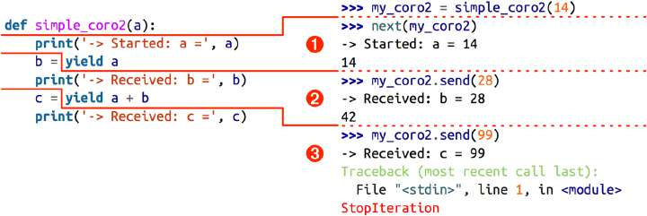
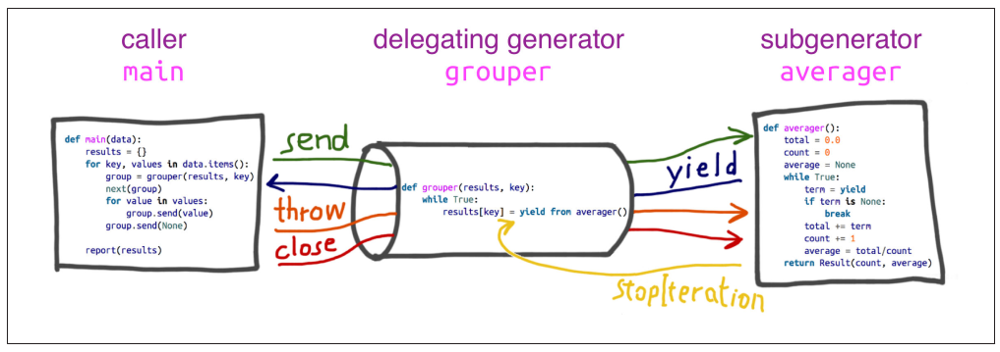

## Chapter 16: Coroutines

Coroutines về cú pháp rất giống generator: chỉ đơn thuần là một hàm có từ khóa `yield`. Về bản chất, coroutine là generator với những tính năng mở rộng: 
-   Từ khóa `yield` thường đứng bên phải một expression: `datum = yield`
-   Coroutine có thể không sinh ra giá trị nào, lệnh `yield` tương đương với `yield None`
-   Người sử dụng có thể gửi data vào coroutine thông qua phương thức `.send()`

Nội dung của chương này bao gồm:
-   Hành vi và trạng thái của generators khi chúng hoạt động như là coroutines
-   "Mồi" coroutine một cách tự động thông qua decorator
-   Kiểm soát coroutine thông qua các phương thức `.close()` và `.throw()`
-   Trả về kết quả khi kết thúc coroutine
-   Sử dụng cú pháp `yield from`
-   Use case: Quản lý các hoạt động cùng lúc sử dụng coroutines

---
### Table of Contents

- [Chapter 16: Coroutines](#chapter-16-coroutines)
  - [Table of Contents](#table-of-contents)
  - [How coroutines evolved from generators](#how-coroutines-evolved-from-generators)
  - [Basic Behavior of a Generator Used as a Coroutine](#basic-behavior-of-a-generator-used-as-a-coroutine)
  - [Example: Coroutine to Compute a Running Average](#example-coroutine-to-compute-a-running-average)
  - [Decorators for coroutine priming](#decorators-for-coroutine-priming)
  - [Coroutine termination and exception handling](#coroutine-termination-and-exception-handling)
  - [Returning a value from a coroutine](#returning-a-value-from-a-coroutine)
  - [Using yield from](#using-yield-from)
  - [The Meaning of yield from](#the-meaning-of-yield-from)
  - [Use Case: Coroutines for Discrete Event Simulation](#use-case-coroutines-for-discrete-event-simulation)
    - [The taxi fleet simulation](#the-taxi-fleet-simulation)
  - [Summary](#summary)

---
### How coroutines evolved from generators

PEP 342 (Python2.5) định nghĩa ra cách implement coroutine từ generator functions thông qua các phương thức mới bao gồm:
-   `.send(value)`: Truyền `value` vào trong generator object
-   `.close()`: raise `GeneratorExit`
-   `.throw(exc)`: raise exeption bên trong generator
-   Cả ba phương thức này đều trả về giá trị tiếp theo được yield hoặc raise `StopIteration`

PEP 380 (Python3.3) thêm vào hai cú pháp khác cho generator hoạt động như coroutine:
-   Có thể `return` bên trong generator (làm điều này trước đó sẽ sinh ra `SyntaxError`)
-   Cú pháp `yield from` giúp biến generators thành các generators lồng một cách tiện dụng

---
### Basic Behavior of a Generator Used as a Coroutine

Trước hết, hãy bắt đầu bằng một coroutine đơn giản nhất:

```python
>>> def simple_coroutine():
...     print('-> coroutine started')
...     x = yield
...     print('-> coroutine received:', x)
```

Sử dụng coroutine này:
```python
>>> my_coro = simple_coroutine()
>>> next(my_coro)
-> coroutine started
>>> my_coro.send(42)
coroutine received: 42
```

*Chú ý:*
-   Lệnh `next(my_coro)` khiến generator chạy đến `yield` thì dừng, do bên phải `yield` không có gì nên generator ngầm định là `yield None`
-   Lệnh `my_coro.send(42)` khiến generator truyền `42` vào `x` rồi chạy tiếp tới lệnh `yield` tiếp theo. Ta có thể thấy nó đã ỉn ra màn hình số 42 và do generator function return mà không có lệnh `yield` nào nữa, generator sẽ raise `StopIteration`

Mỗi coroutine là một state machine với 4 trạng thái:
-   `GEN_CREATED`: Đang chờ để được thực thi
-   `GEN_RUNNING`: Đang được thực thi bởi trình thông dịch
-   `GEN_SUSPENDED`: Đang dừng tại lệnh `yield`
-   `GEN_CLOSED`: Đã kết thúc

Có thể quan sát trạng thái của generator hiện tại bằng hàm `inspect.getgeneratorstate`.

Do tham số truyền vào `.send()` cần được gán vào biến `x` đang chờ tại lệnh `yield`, nếu ta send ngay giá trị vào coroutine đang ở trạng thái `GEN_CREATED` thì sẽ sinh ra lỗi, do coroutine vẫn chưa được thực thi nên chưa dừng ở lệnh `yield` nào cả:
```python
>>> my_coro = simple_coroutine()
>>> my_coro.send(1729)
Traceback (most recent call last):
  File "<stdin>", line 1, in <module>
TypeError: can't send non-None value to a just-started generator
```

Do vậy, ta cần "mồi" coroutine bằng cách gọi `next()` hoặc `send(None)` trên nó trước khi truyền vào giá trị.

Để làm rõ ý "coroutine dừng ở lệnh `yield`", ta sẽ mở rộng ví dụ với coroutine chứa tham số và 2 lệnh `yield`:
```python
>>> def simple_coro2(a):
...     print('-> Started: a =', a)
...     b = yield a
...     print('-> Received: b =', b)
...     c = yield a + b
...     print('-> Received: c =', c)
```

Sử dụng coroutine này:
```python
>>> my_coro2 = simple_coro2(14)
>>> from inspect import getgeneratorstate
>>> getgeneratorstate(my_coro2)
'GEN_CREATED'
>>> next(my_coro2)
-> Started: a = 14
14
>>> getgeneratorstate(my_coro2)
'GEN_SUSPENDED'
>>> my_coro2.send(28)
-> Received: b = 28
42
>>> my_coro2.send(99)
-> Received: c = 99
Traceback (most recent call last):
File "<stdin>", line 1, in <module>
StopIteration
>>> getgeneratorstate(my_coro2)
'GEN_CLOSED'
```

*Nhận xét:*
-   Ta có thể quan sát trạng thái coroutine rõ ràng hơn khi dùng hàm `getgeneratorstate()`
-   Cú pháp `b = yield a` mang ý nghĩa: yield ra `a`, tạm dừng generator và quay trở lại luồng chính, nếu người dùng chạy tiếp coroutine bằng phương thức `send(val)` thì `val` sẽ được gán cho `b`.

Cần đặc biệt chú ý rằng luồng xử lý của coroutine bị ngắt ngay tại lệnh `yield`, biểu thức bên phải lệnh yield sẽ được xử lý trước và trả về bởi `yield`, phép gán sẽ chỉ được thực hiện sau đó nếu người dùng kích hoạt lại coroutine bằng phương thức `send()`, lúc này biến bên trái dấu `=` sẽ được gán bởi tham số đầu tiên của `send()`. Hình dưới đây minh họa cho điều này:



Giờ ta sẽ đến với những ví dụ coroutine có ý nghĩa hơn.

---
### Example: Coroutine to Compute a Running Average

Trong chương 7, ta đã học về cách tính trung bình cộng của một running sequence. Tại đây, ta sẽ implement lại nó sử dụng coroutine

```python
def averager():
    total = 0.0
    count = 0
    average = None

    while True:
        term = yield average
        total += term
        count += 1
        average = total / count
```

Giờ ta có thể sử dụng nó bằng cách truyền tham số vào phương thức `send`:

```python
>>> coro_avg = averager()
>>> next(coro_avg)
>>> coro_avg.send(10)
10.0
>>> coro_avg.send(30)
20.0
>>> coro_avg.send(5)
15.0
```

*Nhận xét:*
-   Coroutine này chạy một infinite loop và sẽ chỉ dừng nếu như người dùng gọi `.close()` trên nó hoặc khi nó bị GC thu hồi nếu không có tham chiếu nào trỏ đến nó nữa
-   Cách làm này đơn giản hơn cả cách dùng higher-order function vì ta chỉ dùng một "hàm" coroutine và không phải dùng closure để duy trì context giữa các lần gọi

---
### Decorators for coroutine priming

Trước khi sử dụng một sử dụng một coroutine, ta cần mồi (prime) nó bằng cú pháp `next(x)`. Ta có thể tự động hóa thao tác này bằng một decorator:

```python
def coroutine(func):
    """Decorator: primes `func` by advancing to first `yield`"""
    @wraps(func)
    def primer(*args, **kwargs):
        gen = func(*args, **kwargs)
        next(gen)
        return gen
    return primer
```
Giờ ta chỉ cần đặt decorator `@coroutine` trước chữ ký hàm `averager` và sử dụng nó mà không cần mồi nữa.

Chú ý, khi dùng cú pháp `yied from` thì coroutine tạo ra đã được mồi sẵn rồi, ta không cần phải dùng decorator `@coroutine` cho nó nữa.

---
### Coroutine termination and exception handling

Nếu một ngoại lệ xảy ra bên trong coroutine, nó sẽ được chuyển về nơi gọi phương thức `next` hay `send`:
```python
>>> coro_avg = averager()
>>> coro_avg.send(40)
40.0
>>> coro_avg.send(50)
45.0
>>> coro_avg.send('spam')
Traceback (most recent call last):
...
TypeError: unsupported operand type(s) for +=: 'float' and 'str'
>>> coro_avg.send(60)
Traceback (most recent call last):
  File "<stdin>", line 1, in <module>
StopIteration
```

*Nhận xét:*
-   Truyền xâu `'spam'` vào coroutine `coro_avg` gây lỗi `TypeError` do ta không cộng được một số với một xâu
-   Sau khi ngoại lệ xảy ra, luồng hoạt động của coroutine chấm dứt hoàn toàn, ta không thể `send` thêm giá trị nào vào nó nữa 

Ví dụ này cho ta một gợi ý để dừng một coroutine: bằng cách `send` một giá trị sentinel vào cho nó, thông thường giá trị này là `None`, `Ellipsis` hay `StopIteration`. Đoạn code sau đó xử lý giá trị sentinel này thường trả về một ngoại lệ và làm dừng coroutine. Tuy nhiên, cách làm này có hai vấn đề chính:
-   Coroutine không dừng ngay mà vẫn chạy tiếp đến khi xảy ra exception => Cách làm này không được "sạch"
-   Tại nơi gọi `send()` ta phải xử lý ngoại lệ sinh ra bởi thao tác trên giá trị sentinal, người dùng phải biết logic cụ thể của coroutine mới có thể bắt và xử lý ngoại lệ này

Vì lý do đó, Python 2.5 giới thiệu hai cách để truyền ngoại lệ vào coroutine:
-   `generator.throw(exc_type[, exc_value[, traceback]])`: Truyền một exception bất kỳ vào vị trí `yield` hiện tại. Lúc này trên generator xảy ra hai trường hợp:
    -   Nếu generator xử lý ngoại lệ này thì luồng thực thi tiếp diễn đến lệnh `yield` tiếp theo, kết quả trả về của lệnh `yield` này chính là kết quả trả về của `throw`
    -   Ngược lại, nếu ngoại lệ không được xử lý, hoặc sau khi xử lý có một ngoại lệ khác xuất hiện thì ngoại lệ cuối cùng sẽ truyền lan truyền đến vị trí gọi `throw`
-   `generator.close()`: Truyền ngoại lệ `GeneratorExit` vào vị trí `yield` hiện tại. Lúc này trên generator xảy ra ba trường hợp:
    -   Nếu generator không xử lý ngoại lệ này hoặc xử lý và raise `StopIteration` (thường do generator kết thúc) thì sẽ không có lỗi nào trả về vị trí gọi
    -   Nếu generator xử lý ngoại lệ này và thành công tiến đến lệnh `yield` tiếp theo, dù `yield` sinh ra giá trị nào, kể cả `None`, thì cũng sinh ra ngoại lệ `RuntimeError: generator ignored GeneratorExit`
    -   Nếu generator xử lý ngoại lệ này và một ngoại lệ khác xảy ra trước khi tiến đến lệnh `yield` tiếp theo thì ngoại lệ mới này sẽ được truyền về vị trí gọi

Tương tự như vấn đề với [@contextmanager](./c15-context-manager.md#using-contextmanager), việc truyền ngoại lệ vào vị trí `yield` có thể sinh ra những ngoại lệ bất thường. Do vậy ta cần đặt lệnh `yield` vào trong khối `try/finally` dọn dẹp tài nguyên dù luồng xử lý của `yield` có sinh ra ngoại lệ hay không:

```python
def coro_finally():
    try:
        while True:
            try:
                x = yield
            except DemoException:
                print('*** DemoException handled. Continuing...')
            else:
                print('-> coroutine received: {!r}'.format(x))
    finally:
        print('-> coroutine ending')
```

*Chú ý:*
-   Ta không đặt `finally` vào khối `try` bên trong vì ta chỉ muốn hành động dọn dẹp được thực hiện duy nhất một lần trước khi kết thúc coroutine

---
### Returning a value from a coroutine

Conroutine không chỉ `yield` giá trị, nó còn có thể trả về giá trị từ lệnh `return`. Tuy nhiên việc dùng cùng lúc `yield` và `return` dễ gây nhầm lẫn. Bởi vậy, usecase thường gặp nhất khi có cả `yield` và `return` trong một coroutine là:
-   `yield` chỉ được dùng để đọc vào giá trị mà không sinh ra giá trị nào
-   Vòng lặp gọi `yield` bị chấm dứt tại một điểm nào đó
-   Chỉ có một lệnh `return` duy nhất nằm ở cuối coroutine

Ví dụ: Thay đổi `averager` để nó chỉ trả về kết quả trung bình cộng cuối cùng khi nó nhận vào giá trị `None`:

```python
from collections import namedtuple

Result = namedtuple('Result', ['count', 'average'])


def averager()
    total = 0.0
    count = 0
    average = None
    while True:
        if term is None:
            break
        term = yield
        total += term
        count += 1
        average = total / count

    return Result(count, average)
```

Kết quả:
```python
>>> coro_avg = averager()
>>> next(coro_avg)
>>> coro_avg.send(10)
>>> coro_avg.send(30)
>>> coro_avg.send(6.5)
>>> coro_avg.send(None)
Traceback (most recent call last):
   ...
StopIteration: Result(count=3, average=15.5)
```

Vấn đề của đoạn code này đó là nó trả về giá trị cuối cùng trong một ngoại lệ `StopIteration`, đây là hành động không mong muốn. Ở mục tiếp theo ta sẽ bàn đến cách xử lý vấn đề này

---
### Using yield from

`yield from` là một cấu trúc rất mới trong Python, nó làm nhiều thứ hơn `yield` và việc dùng lại từ khóa này có phần misleading, tôi nghĩ rằng một từ khóa khác kiểu như `await` phù hợp hơn là `yield from`.

Một cách tổng quát, khi generator gọi `yield from` subgenerator, subgenerator sẽ chiếm quyền thực thi và `yield` giá trị về cho nơi gọi generator cha một cách trực tiếp. Trong lúc đó, generator cha sẽ bị block cho đến khi subgenerator kết thúc.

Trong chương 14, ta đã biết `yield from` có thể được sử dụng để yield giá trị trong vòng lặp for:

```python
for i in range(10):
    yield i
```

tương đương với:

```python
yield from range(10)
```

Tất nhiên, `yield from` hữu dụng hơn thế. Tính năng chính của `yield from` là mở một đường hầm hai chiều kết nối caller ngoài cùng và generator trong cùng để thông tin có thể được trao đổi giữa chúng một cách trực tiếp. Dưới đây là ví dụ minh họa trực quan cho cách hoạt động của `yield from`:



Ba đối tượng chính tham gia vào luồng hoạt động của subgenerator trong ví dụ trên:
-   *caller*: Đoạn code trong chương trình chính thao tác với đối tượng *delegating generator*
-   *delegating generator*: Generator chứa `yield from`, invoke *subgenerator* và kết nối *subgenerator* với *caller*
-   *subgenerator*: Giao tiếp trực tiếp với *caller* sau khi được gọi đến bởi *delegating generator* bằng cú pháp `yield from`, và trả về ngoại lệ `StopIteration` cho *delegating generator* sau khi kết thúc xử lý

Dưới đây là đoạn code đầy đủ thực thi ví dụ minh họa trên.

(Chú ý: Trong sách Fluent Python, tác giả lấy ví dụ với input là một `dict` gồm các `list`, nhưng để cho đơn giản, tôi viết lại các module để chỉ truyền vào `caller` một `list` giá trị thôi)

```python
from collections import namedtuple

Result = namedtuple('Result', 'count average')

## the subgenerator
def averager():
    total, count, average = 0.0, 0, None
    while True:
        term = yield
        if term is None:
            break
        total += term
        count += 1
        average = total/count
    return Result(count, average)


## the delegating generator
def grouper():
    avg = yield from averager()
    yield avg


## the client code, a.k.a. the caller
def caller(data):
    group = grouper()
    next(group)
    for value in data:
        group.send(value)
    avg = group.send(None) # important!
    print(avg)

if __name__ == '__main__':
    data = [40.9, 38.5, 44.3, 42.2, 45.2, 41.7, 44.5, 38.0, 40.6, 44.5]
    caller(data)
```

*Chú giải:*
-   Hàm `averager()` giữ nguyên như mục trước
-   Hàm `grouper()` gọi `yield from averager()`, giúp `caller()` và `averager()` giao tiếp trực tiếp với nhau. Trong lúc đó, `grouper()` đợi đến khi `averager` trả về kết quả `Result(count, average)` đóng gói trong một ngoại lệ `StopIteration` thì nó sẽ bóc đối tượng `Result` ra và gán nó vào biến `avg`, sau đó `yield avg` về cho caller
-   Hàm `caller()`:
    1.  Khởi tạo coroutine trung gian và lưu vào biến `group`
    2.  Mồi coroutine `group` bằng cách gọi `next` trên nó. Lúc này, logic trong `grouper` sẽ chạy đến lệnh `yield from` và block tại đó
    3.  Liên tục `send` các giá trị nằm trong `data` vào `group`, nhưng thực chất lúc này `caller` đang giao tiếp trực tiếp với `averager`
    4.  Gọi `send(None)` để `averager` break khỏi vòng lặp, tính giá trị trung bình và trả về ngoại lệ `StopIteration` cho `grouper`. Sau đó `grouper` bóc giá trị `Result` từ ngoại lệ này và `yield` nó cho `caller`. Cuối cùng, `caller` thu về giá trị trung bình bằng cách lấy kết quả của câu lệnh `group.send(None)`

Ta có thể làm chuỗi `yield from` trở nên dài hơn, mỗi generator lại gọi đến generator khác, cho đến khi kết thúc bằng một generator chỉ có mệnh đề `yield` hoặc là một `iterator`.

---
### The Meaning of yield from

Greg Ewing - tác giả của cú pháp yield form - mô tả về cú pháp `yield from` trong PEP 380 như sau:
> Khi generator `yield from` một generator khác, tác dụng của nó giống như là khi nội dung của subgenerator được gán vào vị trí của mệnh đề `yield from`. Hơn nữa, subgenerator được phép có thêm mệnh đề `return` trả về một giá trị, giá trị này sẽ trở thành giá trị trả về của mệnh đề `yield from`

Cụ thể hơn, dưới đây là 6 ý mô tả chi tiết cơ chế hoạt động của `yield from` trong PEP 380:
-   Bất kỳ giá trị nào yield ra bởi *subgenerator* đều được truyền thẳng đến *caller*
-   Bất kỳ giá trị nào truyền đến *delegating generator* thông qua phương thức `send()` đều được chuyển thẳng đến *subgenerator*. Nếu giá trị này là `None`, phương thức `__next__()` trên *subgenerator* sẽ được gọi, trường hợp ngược lại, phương thức được gọi là `send()`. Nếu lời gọi này sinh ra ngoại lệ `StopIteration`, luồng thực thi của *delegating generator* sẽ được tiếp tục, nếu sinh ra các ngoại lệ khác thì chúng cũng sẽ lan truyền về *delegating generator*
-   Mệnh đề `return expr` trên các generators đều sinh ra ngoại lệ `StopIteration(expr)` khi chúng kết thúc
-   Giá trị trả về của mệnh đề `yield from` là tham số đầu tiên của ngoại lệ `StopIteration` raised khi *subgenerator* kết thúc
-   Nếu *caller* `throw` ngoại lệ khác `GeneratorExit` vào *delegating generator*, ngoại lệ này sẽ được truyền vào *subgenerator* qua phương thức `throw`. Nếu hành động này sinh ra ngoại lệ `StopIteration` trên *subgenerator* thì luồng xử lý của *delegating generator* sẽ được tiếp tục. Các ngoại lệ khác sẽ được lan truyền về *delegatig generator*
-   Nếu *caller* `throw` ngoại lệ `GeneratorExit` hoặc gọi phương thức `close()` trên *delegating generator*, nếu *subgenerator* có phương thức `close()`, phương thức này sẽ được gọi trên *subgenerator* và mọi ngoại lệ sinh ra đều được truyền về *delegating generator*. Ngược lại, phương thức `close()` sẽ được gọi trên delegating generator

Cơ chế hoạt động của `yield from` chứa nhiều tiểu tiết đáng lưu ý, Greg Ewing đã làm rất tốt để mô tả nó bằng tiếng Anh. Còn dưới đây là mô tả luồng hoạt động của cú pháp `RESULT = yield from EXPR` bằng code Python, hãy cùng luyện não nào:

```python
_i = iter(EXPR)
try:
    _y = next(_i)
except StopIteration as _e:
    _r = _e.value
else:
    while 1:
        try:
            _s = yield _y
        except GeneratorExit as _e:
            try:
                _m = _i.close
            except AttributeError:
                pass
            else:
                _m()
            raise _e
        except BaseException as _e:
            _x = sys.exc_info()
            try:
                _m = _i.throw
            except AttributeError:
                raise _e
            else:
                try:
                    _y = _m(*_x)
                except StopIteration as _e:
                    _r = _e.value
                    break
        else:
            try:
                if _s is None:
                    _y = next(_i)
                else:
                    _y = _i.send(_s)
            except StopIteration as _e:
                _r = _e.value
            break
RESULT = _r
```

---
### Use Case: Coroutines for Discrete Event Simulation

>"Coroutines are a natural way of expressing many algorithms, such as simulations, games, asynchronous I/O, and other forms of event-driven programming or co-operative multitasking"
>
> Guido van Rossum and Phillip J. Eby in PEP 342.

Ở mục này, ta sẽ đề cập đến một trong số các use cases của coroutines: *mô phỏng sự kiện*. Ta sẽ học cách xử lý các hành động concurrent sử dụng coroutine trên một luồng duy nhất. Coroutines cũng chính là nền tảng xây dựng `asyncio`, bởi vậy đây sẽ là bước khởi động tốt trước khi bàn đến concurrent programming với `asyncio` ở chương 18.

Trước hết, ta cần hiểu về khái niệm *discrete event simulation (DES)*. Nó là sự mô phỏng một môi trường mà trong đó trạng thái chỉ thay đổi khi có sự kiện nào đó diễn ra. Ví dụ như các trò chơi theo lượt là một dạng DES bởi vì trạng thái của trò chơi không đổi cho đến khi người chơi quyết định nước đi mới, đối lập với các game thời gian thực khi trạng thái của trò chơi thay đổi liên tục theo thời gian thực.

Cả hai loại mô phỏng trên đều có thể được lập trình đa luồng hoặc đơn luồng sử dụng các kĩ thuật như callbacks hay coroutines điều khiển bởi một vòng lặp sự kiện (event loop). Thông thường, mô phỏng thời gian thực hay được thực hiện bởi kĩ thuật đa luồng, còn mô phỏng sự kiện rời rạc (DES) thường được lập trình bởi coroutines.

#### The taxi fleet simulation

*Kịch bản:* Có n taxi, mỗi taxi thực hiện m chuyến trong ngày. Khi chưa có khách, mỗi taxi ở trong trạng thái "prowling" - tìm khách. Khi có khách rồi, nó chuyển sang trạng thái "hành trình". Sau khi trả khách, nó lại quay về trạng thái tìm khách cho đến khi thực hiện xong m chuyến thì thôi.

*Bước 1: Định nghĩa sự kiện*

```python
Event = collections.namedtuple('Event', 'time proc action')
```

Trong đó:
-   `time`: Thời điểm mà sự kiện diễn ra, được sinh bằng bộ sinh ngẫu nhiên
-   `proc`: Định danh của taxi
-   `action`={'leave garage', 'pick up passenger', 'drop off passenger', 'going home'}: Các hành động của taxi

*Bước 2: Mô phỏng một taxi*

-   Thứ tự hành động của taxi là: rời gara => lặp (đón khách, trả khách) đến khi số chuyến bằng m => trở về nhà. Ta sẽ lập trình một coroutine nhận vào thời điểm `time` và yield `Event` tương ứng:
    ```python
    def taxi_process(id, trips, start_time=0):
        """Yield to simulator issuing event at each stage change"""
        time = yield Event(start_time, id, 'leave garage')
        for i in range(trips):
            time = yield Event(time, id, 'pick up passenger')
            time = yield Event(time, id, 'drop off passenger')

        yield Event(time, id, 'going home')    
    ```

-   Ta có thể tạo ra một taxi như sau:
    ```python
    >>> taxi = taxi_process(id=13, trips=2, start_time=0)
    ```

-   Bắt đầu lịch trình cho taxi này:
    ```python
    >>> next(taxi)
    Event(time=0, proc=13, action='leave garage')
    ```

-   Mỗi lần `send` vào `taxi` coroutine một thời điểm, nó sẽ sinh ra sự kiện tương ứng ở thời điểm đó
    ```python
    Event(time=0, proc=13, action='leave garage')
    >>> taxi.send(_.time + 7)
    Event(time=7, proc=13, action='pick up passenger')
    >>> taxi.send(_.time + 23)
    Event(time=30, proc=13, action='drop off passenger')
    >>> taxi.send(_.time + 5)
    Event(time=35, proc=13, action='pick up passenger')
    >>> taxi.send(_.time + 48)
    Event(time=83, proc=13, action='drop off passenger')
    >>> taxi.send(_.time + 1)
    Event(time=84, proc=13, action='going home')
    >>> taxi.send(_.time + 10)
    Traceback (most recent call last):
    File "<stdin>", line 1, in <module>
    StopIteration
    ```
*Bước 3: Tạo ra một lớp quản lý các `taxi_processes`*, các sự kiện xảy ra trước thì được hiển thị trước -> sử dụng hàng đợi ưu tiên chứa các events

-   Tạo lớp `Simulator` có hai thuộc tính là:
    -   `events`: Một `PriorityQueue` chứa các item là các đối tượng `Event` với trường khóa mặc định là `item[0]`, tức là trường `time` của `Event`
    -   `procs`: Một `dict` map giữa process id và process instance tương ứng

-   Định nghĩa phương thức `Simulator.run()` lặp lại các bước: (1) Lấy ra event có `time` nhỏ nhất từ hàng đợi `events`, (2) in thông tin của event, (3) feed ngẫu nhiên thời điểm xảy ra sự kiện tiếp theo cho process có `proc.id == event.proc`, (4) nhận được một event mới (hoặc kết thúc process), (5) nạp  event vào hàng đợi - taxi đợi chuyến tiếp theo (hoặc hủy process - taxi về nhà) cho đến khi hàng đợi `events` không còn sự kiện nào nữa (taxi đã về nhà hết):

    ```python
    from random import randint
    from queue import PriorityQueue

    class Simulator:

        def __init__(self, procs_map):
            self.events = PriorityQueue
            self.procs = dict(procs_map)

        def run(self, end_time):
            """Schedule and display events until time is up"""

            # schedule the first event for each taxi
            for _, proc in sorted(self.procs.items()):
                first_event = next(proc)
                self.events.put(first_event)

            # main loop of the simulation
            sim_time = 0
            while end_time > sim_time:
                if self.events.empty():
                    print('*** end of events ***')
                    break

                # get the event with the smallest time in the queue...
                current_event = self.events.get()
                sim_time, proc_id, previous_action = current_event

                # ...and print it out
                print('taxi: ', proc_id, proc_id * '\t', current_event)

                # evaluate the next time an event occurs in current process...
                next_time = sim_time + randint(1, 5)

                # ... and generate the next event from current process
                try:
                    next_event = self.procs[proc_id](next_time)
                except StopIteration
                    # if there's no more events, remove reference to the process
                    del self.procs[proc_id]
                else:
                    # put the new event on the queue
                    self.events.put(next_event)
            else:
                msg = '*** end of simulation time: {} events pending ***'
                print(msg.format(self.events.qsize()))
    ```

Bước 4: Chạy chương trình:
```python
>>> taxis = {0: taxi_process(id=0, trips=2, start_time=0),
         1: taxi_process(id=1, trips=4, start_time=5),
         2: taxi_process(id=2, trips=6, start_time=10)}
>>> sim = Simulator(taxis)
>>> sim.run(50)
taxi:  0  Event(time=0, proc=0, action='leave garage')
taxi:  0  Event(time=3, proc=0, action='pick up passager')
taxi:  1      Event(time=5, proc=1, action='leave garage')
taxi:  0  Event(time=6, proc=0, action='drop off passanger')
taxi:  1      Event(time=6, proc=1, action='pick up passager')
taxi:  0  Event(time=10, proc=0, action='pick up passager')
taxi:  2          Event(time=10, proc=2, action='leave garage')
taxi:  1      Event(time=11, proc=1, action='drop off passanger')
taxi:  0  Event(time=13, proc=0, action='drop off passanger')
taxi:  2          Event(time=13, proc=2, action='pick up passager')
taxi:  1      Event(time=14, proc=1, action='pick up passager')
taxi:  0  Event(time=15, proc=0, action='going home')
taxi:  2          Event(time=15, proc=2, action='drop off passanger')
taxi:  1      Event(time=17, proc=1, action='drop off passanger')
taxi:  2          Event(time=17, proc=2, action='pick up passager')
taxi:  1      Event(time=21, proc=1, action='pick up passager')
taxi:  2          Event(time=21, proc=2, action='drop off passanger')
taxi:  1      Event(time=23, proc=1, action='drop off passanger')
taxi:  2          Event(time=26, proc=2, action='pick up passager')
taxi:  1      Event(time=28, proc=1, action='pick up passager')
taxi:  2          Event(time=29, proc=2, action='drop off passanger')
taxi:  1      Event(time=30, proc=1, action='drop off passanger')
taxi:  2          Event(time=32, proc=2, action='pick up passager')
taxi:  1      Event(time=35, proc=1, action='going home')
taxi:  2          Event(time=37, proc=2, action='drop off passanger')
taxi:  2          Event(time=39, proc=2, action='pick up passager')
taxi:  2          Event(time=44, proc=2, action='drop off passanger')
taxi:  2          Event(time=46, proc=2, action='pick up passager')
taxi:  2          Event(time=48, proc=2, action='drop off passanger')
taxi:  2          Event(time=51, proc=2, action='going home')
*** end of simulation time: 0 events pending ***
```

*Nhận xét:* Ví dụ này cho ta một cái nhìn đơn giản nhất về cách thức lập trình đồng thời (concurrent programming) sử dụng vòng lặp sự kiện: Mỗi coroutine chỉ thực hiện hành động trong khoảng thời gian ngắn rồi bước vào khoảng thời gian chờ. Lúc này vòng lặp chính lấy lại quyền kiểm soát và trao quyền thực thi cho một coroutine khác. Khi thời gian chờ kết thúc, coroutine lại được trao quyền thực thi, cứ như vậy cho đến khi tất cả các coroutines đều hoàn thành hết nhiệm vụ của mình.

---
### Summary

Có ba loại phong cách code generator: phong cách "pull" (như iterators), phong cách "push" (như ví dụ tính trung bình cộng) hay phong cách "tasks" (như ví dụ mô phỏng taxi). Ta sẽ bàn cụ thể hơn về phong cách cuối cùng khi lập trình các asynchronus tasks trong chương 18.

Ví dụ về hàm tính trung bình cộng thể hiện một ca sử dụng phổ biến của coroutine: tổng hợp dữ liệu truyền vào nó. Ta cũng thấy ví dụ sử dụng decorator để tự động mồi coroutines, nhưng cần chú ý là cách này có thể không phù hợp với nhiều thủ tục và cú pháp nhận vào một coroutine chưa được mồi và tự động mồi nó (như cú pháp `yield from`).

Coroutine tổng hợp có thể trả về một phần giá trị thông qua các lệnh `yield`, nhưng những giá trị này thường không có nhiều ý nghĩa bằng giá trị trả về cuối cùng thông qua mệnh đề `return` - tính năng xuất hiện tại Python 3.3 thông qua PEP 380. Cú pháp `return result` gây ra ngoại lệ `StopIteration(result)`, cho phép người dùng lấy về `result` từ ngoại lệ này. Mặc dù cách làm này hơi lằng nhằng, nhưng thường thì nó được tự động thực hiện qua cú pháp `yield from`.

Ví dụ đầu tiên đơn giản nhất của cú pháp `yield from` là `yield from iterable`: lấy ra các phần tử của `iterable`. Sau đó, ta tiến tới một ví dụ hoàn chỉnh về luồng hoạt động của chương trình bao gồm một *caller* giao tiếp với *subgenerator* thông qua một đường hầm tạo ra bởi cú pháp `yield from` nằm trên *delegating generator*. Cuối cùng, ta kết thúc mục này bằng một bài luyện não thông qua đoạn mã giả Python mô phỏng luồng hoạt động của *delegating generator*.

Ta kết thúc chương bằng một ví dụ mô phỏng sự kiện rời rạc đơn giản, cho thấy khả năng của generators trong việc cung cấp một giải pháp bên cạnh threads và callbacks trong việc hỗ trợ tính toán đồng thời. Dù đơn giản, ví dụ mô phỏng taxi cho chúng ta một cái nhìn đầu tiên về cách hoạt động của các event-driven framework như `asyncio` - sử dụng một vòng lặp chính để thực thi các tác vụ đồng thời trên một luồng duy nhất. Trong lập trình hướng sự kiện với coroutines, mỗi hành động đồng thời được thực thi trong một coroutine trong một khoảng thời gian nào đó rồi yield lại quyền kiểm soát cho vòng lặp chính để nó trao quyền thực thi cho các coroutines khác. Đây là một dạng của đa nhiệm hợp tác (cooperative multitasking): các coroutines tình nguyện trao lại quyền kiểm soát cho bộ điều phối trung tâm khi nó bước vào trạng thái chờ. Điều này là ngược lại đối với cơ chế lập trình đa nhiệm chiếm đoạt (preemtive multitasking) của threads, khi mà bộ xử lý trung tâm có thể tạm dừng luồn bất kỳ lúc nào để trao quyền thực thi cho các luồng khác.

Một chú ý cuối cùng: Chương này sử dụng một khái niệm rộng của coroutine - một generator function được sử dụng bởi client gọi lệnh `send()` trên nó, hoặc là được sử dụng thông qua cú pháp `yield from`. Đây là định nghĩa chuẩn và được sử dụng trong nhiều tài liệu Python khác nhau. Tuy nhiên, ở Chương 18 nói về asyncio, ta sẽ nhắc tới coroutine với một định nghĩa chặt hơn: Một asyncio coroutine, với `@asyncio.coroutine` deccorator, luôn được sử dụng bởi cú pháp `yield from` mà không gọi `send()` trực tiếp trên nó. Tất nhiên `asyncio` vẫn dùng `next()` hay `send()` ở dưới, nhưng user code chỉ cần dùng `yield from` mà thôi.
